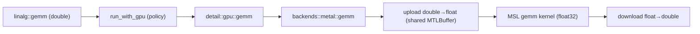

# Changelog

All notable changes to this project are documented here.

Format follows [Keep a Changelog](https://keepachangelog.com/en/1.1.0/).
Versioning is early-stage (`0.1.x`); breaking API changes are expected until `1.0`.

## [Unreleased]

### 2026-06-29 — Metal GPU backend (macOS)

Implemented the macOS Metal backend for all 11 Tier‑1 linalg ops, replacing the stub so `COMPUTE_ENABLE_METAL=ON` offloads to the Apple GPU through the existing dispatch layer.

Technical summary

**Motivation.** The dispatch layer (`CUDA → Metal → Vulkan`) was fully wired but `compute::backends::metal::*` was a stub returning "not available". This makes Metal a real backend so the engine has a working GPU path on Apple Silicon (the project's CUDA path is NVIDIA/Linux‑only).

**Key constraint — no float64 on Apple GPUs.** Metal Shading Language has no `double` type. The engine's API is `double`/column‑major, so the backend converts `double → float` on upload, computes in **float32** on the GPU (`MTLResourceStorageModeShared` buffers — no explicit copy), and converts back on readback. Consequence: results carry float32 error. For an inner product / GEMM column of length $k$ the relative error is bounded by

$$\frac{k\,\varepsilon_{32}}{1 - k\,\varepsilon_{32}} \approx k\,\varepsilon_{32}, \qquad \varepsilon_{32} = 2^{-24} \approx 5.96\times10^{-8}.$$

`[metal]` tests therefore use float32‑derived tolerances (`1e-5` element‑wise, `1e-4` accumulating) instead of Eigen's default `~1e-12`. `cpu_only` policy stays full double; `automatic`/`gpu_preferred` accept the float32 tradeoff on Apple GPUs.

**Approach.** Mirrors the CUDA backend's structure: a cached `MetalContext` singleton (device, command queue, runtime‑compiled `MTLLibrary`, pipeline‑state cache) in [`src/compute/metal/detail/context.mm`](src/compute/metal/detail/context.mm), and the 11 ops in [`src/compute/metal/linalg/linalg_dispatch.mm`](src/compute/metal/linalg/linalg_dispatch.mm). Six MSL kernels (elementwise, transpose, gemm, gemv, reduce_dot, row_abs_sum); `trace` and `norm_fro` reuse GPU `dot` exactly as CUDA does. Column‑major indexing `index(i,j)=j*rows+i` is preserved in every kernel.

**Shaders live in a real `.metal` file.** [`src/compute/metal/linalg/kernels.metal`](src/compute/metal/linalg/kernels.metal) is the single source of truth. The Metal shader **compiler toolchain** (`xcrun metal`/`metallib`) is not installed by default (needs `xcodebuild -downloadComponent MetalToolchain`), so instead of a precompiled `.metallib` the CMake step embeds `kernels.metal` into a generated header ([`kernels_source.h.in`](src/compute/metal/detail/kernels_source.h.in) → `metal_kernels_source.h`) and the library is compiled at runtime via `-[MTLDevice newLibraryWithSource:options:error:]`. `CMAKE_CONFIGURE_DEPENDS` re‑embeds on edit.

| File | Change |
|------|--------|
| [`src/compute/metal/linalg/kernels.metal`](src/compute/metal/linalg/kernels.metal) | New — 6 float32 MSL compute kernels (column‑major) |
| [`src/compute/metal/detail/context.h`](src/compute/metal/detail/context.h) | New — `MetalContext` interface (Obj‑C++) |
| [`src/compute/metal/detail/context.mm`](src/compute/metal/detail/context.mm) | New — device/queue/library init, pipeline cache, double↔float buffer helpers |
| [`src/compute/metal/detail/kernels_source.h.in`](src/compute/metal/detail/kernels_source.h.in) | New — template that embeds `kernels.metal` as a raw string |
| [`src/compute/metal/linalg/linalg_dispatch.mm`](src/compute/metal/linalg/linalg_dispatch.mm) | New — 11 `compute::backends::metal::*` ops |
| [`src/compute/metal/CMakeLists.txt`](src/compute/metal/CMakeLists.txt) | `APPLE` branch builds `.mm` (ARC) + links Foundation/Metal frameworks + embeds shader; else keeps `stub.cpp` |
| [`tests/unit/test_linalg_gpu.cpp`](tests/unit/test_linalg_gpu.cpp) | Real `[metal]` tests (12 cases, float32 tolerances); shared helpers now cover CUDA **and** Metal |
| [`CMakePresets.json`](CMakePresets.json) | New `relwithdebinfo-metal` / `release-metal` presets |

**Not changed:** public headers, dispatch layer, Python bindings (Metal is reached through the same C++ entry points via policy). Vulkan stays a Linux‑only scaffold — on macOS the GPU path is Metal (MoltenVK intentionally out of scope; existing Vulkan shaders use `float64_t` and would not run on Apple GPUs anyway).

### Added

- **Linear algebra Tier 1 (CPU)** — `add`, `sub`, `scale`, `hadamard`, `transpose`, `dot`, `gemv`, `gemm`, `trace`, `norm_fro`, `norm_inf` under `compute::linalg`.
- **Non-owning matrix views** — `const_matrix_view` / `matrix_view` with column-major layout and `core::Result` validation.
- **GPU dispatch layer** — `ComputePolicy`-driven routing (`cpu_only`, `gpu_preferred`, `automatic`) with size thresholds in `detail/gpu_dispatch.hpp`.
- **CUDA backend** (`COMPUTE_ENABLE_CUDA`):
  - Custom kernels: elementwise ops, transpose, infinity norm.
  - cuBLAS: `Dgemm`, `Dgemv`, `Ddot`.
  - Device context with stream + cuBLAS handle.
- **Metal backend scaffold** (`COMPUTE_ENABLE_METAL`) — stub on Linux; real MSL path reserved for macOS.
- **Vulkan backend scaffold** (`COMPUTE_ENABLE_VULKAN`) — GLSL compute shaders compiled at build time; runtime context pending.
- **Python bindings** — `_compute_linalg` nanobind module with zero-copy NumPy I/O (Fortran-order matrices).
- **Tests** — `test_linalg.cpp` (CPU + Eigen oracle), `test_linalg_gpu.cpp` (CUDA with `gpu_preferred`).
- **CMake presets** — `release-cuda`, `release-gpu`.
- **Docs** — `CONTRIBUTING.md` (expanded), `docs/diagrams/gpu-dispatch.excalidraw`.

### Changed

- `compute::core` — `g_policy` is no longer `inline thread_local` in a header (required for nanobind shared modules).
- `src/compute/CMakeLists.txt` — `compute_linalg` is a real static library (no longer an INTERFACE placeholder).
- `cmake/CUDAConfig.cmake` — `CMAKE_CUDA_ARCHITECTURES` set to `86` (RTX 3060).
- CUDA host dispatch split: C++23 `.cpp` for `Result` / cuBLAS, `.cu` for `__global__` kernels only.

### Fixed

- Python extension link failure (`R_X86_64_TPOFF32` / thread-local `g_policy`) — `ComputePolicy` state moved to `src/compute/core/compute_policy.cpp`; `compute_core` is now a PIC static library.
- Eigen FetchContent test pollution — `EIGEN_BUILD_TESTING=OFF` when fetching for unit tests.
- cuBLAS `Dgemm` leading dimensions corrected for column-major storage.

## [0.1.0] — Week 1

### Added

- CMake 4.3 + Ninja skeleton with `debug`, `relwithdebinfo`, `release` presets.
- `compute::core` — `aligned_buffer`, `simd_traits`, `ComputePolicy`, `Result<T>`, version.
- nanobind `_compute_core` — `version`, `set_policy`, `get_policy`, `ComputePolicy`.
- Catch2 unit tests for core module.

[Unreleased]: https://github.com/your-org/compute/compare/v0.1.0...HEAD
[0.1.0]: https://github.com/your-org/compute/releases/tag/v0.1.0
