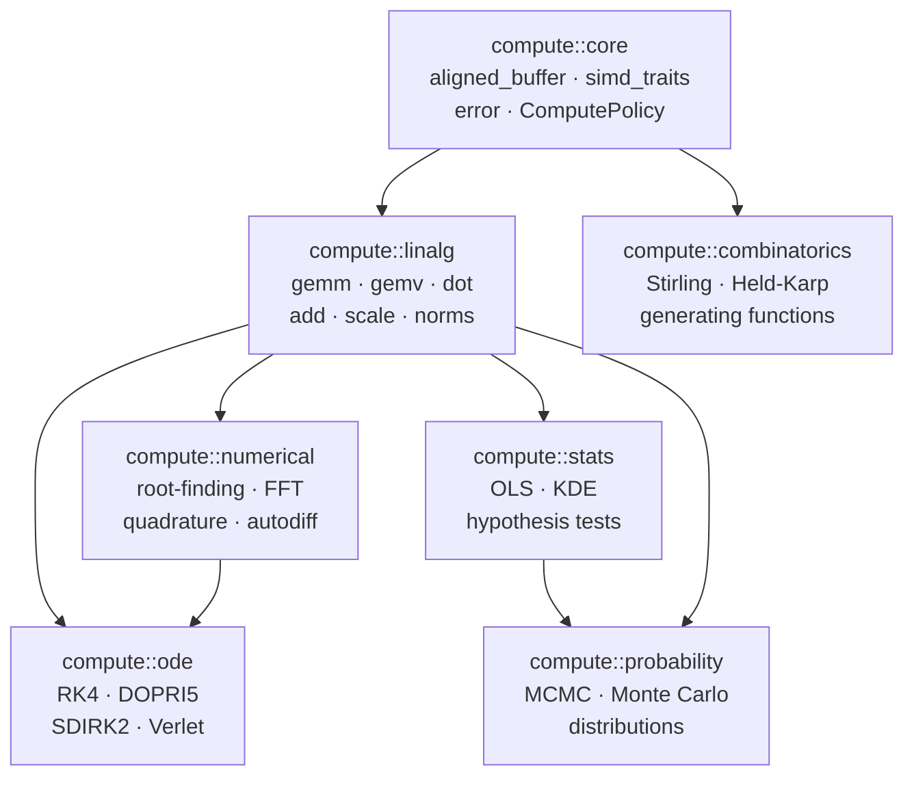
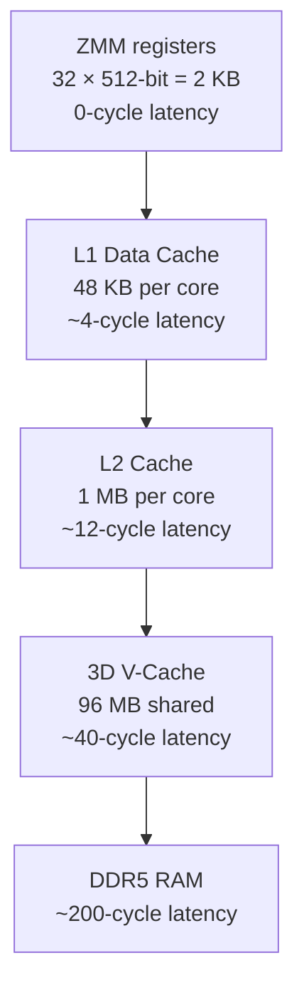
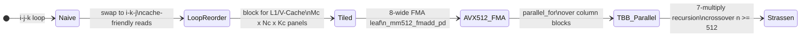

# Session Journal — 2026-06-29

**Topic coverage:**
1. [Module composition and codebase organisation](#module-composition--codebase-organisation)
2. [CPU-level linalg optimisations](#cpu-level-linalg-optimisations)
3. [General perspective](#general-perspective)

---

## Module Composition & Codebase Organisation

### The core insight

`compute::linalg` is not just one module among others — it is the computational substrate that every other math module builds on. The three primitives it provides collapse into almost every higher-level algorithm:

$$C = AB \quad \text{(GEMM)}, \qquad y = Ax \quad \text{(GEMV)}, \qquad s = u \cdot v \quad \text{(dot)}$$

A higher module never reimplements loops over matrix elements. It composes these three primitives (plus `add`, `scale`, `hadamard`) into its own algorithms.

### Module dependency DAG



The DAG is acyclic by design. `linalg` sits at the bottom of the math stack; `core` sits below everything. No module depends on anything above it in the hierarchy.

### How concrete ops map to higher modules

| Higher module | Algorithm | Linalg ops consumed |
|--------------|-----------|---------------------|
| `compute::ode` | RK4 stage: `y + h·(a₁k₁ + a₂k₂ + ...)` | `scale`, `add`, `gemv` (for `f(t,y) = Ay`) |
| `compute::stats` | OLS normal equations: `XᵀX β = Xᵀy` | `gemm`, `gemv`, later `linalg::solve` (LU/QR Tier 3) |
| `compute::numerical` | Newton step: solve `J Δx = -f(x)` | `gemv` (Jacobian-vector), future `linalg::lu_solve` |
| `compute::probability` | MCMC covariance update, Gibbs sampler | `gemm`, `dot`, `norm_fro` |
| `compute::numerical` | Conjugate Gradient: `r = b - Ax`, `p = r + β·p` | `gemv`, `dot`, `scale`, `add` |

Higher module implementations will look like:

```cpp
// include/compute/ode/rk4.hpp
#include <compute/linalg.hpp>  // or granular headers

namespace compute::ode {
core::Result<void> rk4_step(std::span<double> y,
                             const_matrix_view A,
                             double h) noexcept;
}
```

They call linalg. They own no GPU dispatch code — that is handled transparently by `ComputePolicy` inside the ops they call.

### Shared contracts between modules

Three things must never be duplicated across modules:

| Contract | Type | File |
|----------|------|------|
| Matrix layout and views | `const_matrix_view` / `matrix_view` | [`include/compute/linalg/layout.hpp`](../../include/compute/linalg/layout.hpp) |
| Error propagation | `core::Result<T>` (`std::expected`) | [`include/compute/core/error.hpp`](../../include/compute/core/error.hpp) |
| GPU routing | `ComputePolicy`, `run_with_gpu()` | [`include/compute/linalg/detail/route.hpp`](../../include/compute/linalg/detail/route.hpp) |

### Python subpackage plan

Today the Python package is flat:

```python
from compute import gemm, dot, ComputePolicy
```

As modules grow, the intent is namespaced submodules:

```python
from compute import linalg, ode, stats
linalg.gemm(A, B, C)
ode.rk4(f, y0, t_span)
stats.ols(X, y)
```

Each C++ module becomes one nanobind extension (`_compute_<module>`) re-exported as a subpackage. The `compute_python_module()` CMake function in [`cmake/PythonBindings.cmake`](../../cmake/PythonBindings.cmake) already automates this wiring.

### CMake dependency pattern

When `numerical` becomes a real library (not an INTERFACE placeholder), the CMake target dependency is:

```cmake
add_library(compute_numerical STATIC ...)
target_link_libraries(compute_numerical PUBLIC compute_linalg)
# PUBLIC: headers and symbols propagate to consumers of compute_numerical
```

Currently all non-linalg modules are INTERFACE placeholders in [`src/compute/CMakeLists.txt`](../../src/compute/CMakeLists.txt), waiting for real implementations.

### Section references

| Resource | Purpose |
|----------|---------|
| [`include/compute/linalg.hpp`](../../include/compute/linalg.hpp) | Umbrella include for all Tier 1 ops |
| [`include/compute/core/error.hpp`](../../include/compute/core/error.hpp) | `Result<T>`, `ErrorCode`, `ComputeError` |
| [`src/compute/CMakeLists.txt`](../../src/compute/CMakeLists.txt) | Module library definitions, current placeholders |
| [`scripts/python/compute/__init__.py`](../../scripts/python/compute/__init__.py) | Python package re-exports |
| [`CONTRIBUTING.md`](../../CONTRIBUTING.md) | Contributor guide — GPU dispatch, bindings, adding ops |
| [`obsidian/modules/Numerical Analysis.md`](../../obsidian/modules/Numerical%20Analysis.md) | Planned numerical module breakdown |

---

## CPU-Level Linalg Optimisations

### Memory hierarchy on the 9800X3D

The Ryzen 9800X3D is unusual: its 96 MB 3D V-Cache sits between L2 and DDR5, making cache-oblivious and blocked algorithms behave differently from textbook predictions.



Practical implication: standard advice to use 64×64 tile sizes (targeting 48 KB L1) is often sub-optimal here. Empirically, larger tiles — up to 256×256 doubles (512 KB) — can stay warm in the V-Cache, outperforming what a standard 1 MB L2 CPU would achieve.

### Why naive GEMM is slow

The current implementation in [`src/compute/linalg/gemm.cpp`](../../src/compute/linalg/gemm.cpp):

```cpp
for (std::size_t i = 0; i < m; ++i)
    for (std::size_t j = 0; j < n; ++j)
        for (std::size_t p = 0; p < k; ++p)
            C(i, j) += A(i, p) * B(p, j);
```

For column-major storage, `A(i,p) = data[p*m + i]` and `B(p,j) = data[j*k + p]`. The inner loop increments `p`:
- `A(i,p)`: stride `m` — one cache miss per iteration
- `B(p,j)`: stride `1` — sequential, good
- `C(i,j)`: constant address — fine

Swapping to `i-k-j` order (with `j` inner) makes the inner loop read `B` and `C` with unit stride. Same three loops, no code complexity change, ~8–10× cache efficiency improvement before any SIMD.

### Optimisation progression



### Key formulas

**GEMM FLOP count** — for \( C = AB \), \( A \in \mathbb{R}^{m \times k} \), \( B \in \mathbb{R}^{k \times n} \):

$$\text{FLOPs} = 2mnk \qquad \Rightarrow \qquad \text{GFLOPS} = \frac{2mnk}{t \times 10^9}$$

**Theoretical AVX-512 FP64 peak** on a single core at 4 GHz:

$$\underbrace{8}_{\text{doubles per ZMM}} \times \underbrace{2}_{\text{FMA = mul + add}} \times \underbrace{4 \times 10^9}_{\text{Hz}} = 64 \;\text{GFLOPS/core}$$

**Cache complexity of GEMM** — optimal for cache size \( M \) (proven by Frigo et al. 1999):

$$Q(n) = \Theta\!\left(\frac{n^3}{\sqrt{M}}\right)$$

Cache-oblivious recursive GEMM achieves this bound without knowing \( M \) at compile time.

**Strassen recurrence** — 7 multiplications on \( 2 \times 2 \) block partitions instead of 8:

$$T(n) = 7\,T\!\left(\frac{n}{2}\right) + O(n^2) \quad \Longrightarrow \quad T(n) = O\!\left(n^{\log_2 7}\right) \approx O(n^{2.807})$$

The seven intermediate matrices (Winograd form):

$$\begin{aligned}
M_1 &= (A_{11}+A_{22})(B_{11}+B_{22}) \\
M_2 &= (A_{21}+A_{22})\,B_{11} \\
M_3 &= A_{11}(B_{12}-B_{22}) \\
M_4 &= A_{22}(B_{21}-B_{11}) \\
M_5 &= (A_{11}+A_{12})\,B_{22} \\
M_6 &= (A_{21}-A_{11})(B_{11}+B_{12}) \\
M_7 &= (A_{12}-A_{22})(B_{21}+B_{22})
\end{aligned}$$

**AVX-512 SIMD width** — `simd_traits<double>::width` at compile time:

$$\text{width} = \frac{512\text{ bits}}{64\text{ bits/double}} = 8 \quad \Rightarrow \quad \text{one } \mathtt{\_\_m512d} \text{ holds 8 doubles}$$

### Optimisation roadmap table

| Technique | Ops affected | Effort | Where it lands | Expected gain |
|-----------|-------------|--------|----------------|---------------|
| Loop interchange (`i-k-j`) | `gemm` | Low | [`src/compute/linalg/gemm.cpp`](../../src/compute/linalg/gemm.cpp) | 8–10× over naive |
| SIMD element-wise | `add`, `scale`, `hadamard`, `dot`, norms | Medium | [`include/compute/linalg/detail/elementwise.hpp`](../../include/compute/linalg/detail/elementwise.hpp) | Memory bandwidth limited → matches bandwidth roof |
| Cache-blocked GEMM | `gemm` | Medium | new `include/compute/linalg/detail/gemm_blocked.hpp` | Tile hits V-Cache, avoids DDR5 |
| Cache-oblivious transpose | `transpose` | Medium | [`src/compute/linalg/transpose.cpp`](../../src/compute/linalg/transpose.cpp) | Large matrices: 4–8× |
| AVX-512 FMA micro-kernel | `gemm` leaf, `gemv` row dot | High | new `include/compute/linalg/detail/simd.hpp` | Approaches 64 GFLOPS/core peak |
| TBB `parallel_for` | element-wise, `gemv` rows, `gemm` col blocks | Medium | same `.cpp` files | Near-linear scaling to 8 threads |
| Strassen | `gemm` (n ≥ 512) | High | new `include/compute/linalg/detail/gemm_strassen.hpp` | ~15% over blocked+SIMD at large n; numerical risk |

### Alignment and SIMD integration

[`core::aligned_buffer<T, 64>`](../../include/compute/core/aligned_buffer.hpp) guarantees 64-byte alignment required for `_mm512_load_pd`. Panel-packing scratch buffers must use it:

```cpp
core::aligned_buffer<double, 64> packed_A(Mc * Kc);
core::aligned_buffer<double, 64> packed_B(Kc * Nc);
```

[`simd_traits<double>::width`](../../include/compute/core/simd_traits.hpp) is `8` under `-march=native` with AVX-512, driving loop unroll strides and tile size computations at compile time.

### What not to do first

- Strassen before a working blocked GEMM — usually slower in practice below n ≈ 512
- Parallelising every op — TBB overhead dominates below ~10⁴–10⁵ elements (same threshold logic as GPU dispatch)
- Hand-written assembly — intrinsics + good blocking reaches 80–90% of peak on Zen 5

### Section references

| Resource | Purpose |
|----------|---------|
| [`cmake/CompilerOptions.cmake`](../../cmake/CompilerOptions.cmake) | `-march=native`, `-ffast-math`, LTO flags |
| [`include/compute/core/simd_traits.hpp`](../../include/compute/core/simd_traits.hpp) | Compile-time SIMD width detection |
| [`include/compute/core/aligned_buffer.hpp`](../../include/compute/core/aligned_buffer.hpp) | 64-byte aligned heap allocation for packed panels |
| [`src/compute/linalg/gemm.cpp`](../../src/compute/linalg/gemm.cpp) | Current naive i-j-k loop — first target |
| [`include/compute/linalg/detail/elementwise.hpp`](../../include/compute/linalg/detail/elementwise.hpp) | Shared element-wise kernel — first SIMD target |
| [`include/compute/linalg/detail/gpu_dispatch.hpp`](../../include/compute/linalg/detail/gpu_dispatch.hpp) | Size thresholds for GPU vs CPU — mirror for TBB |
| [`obsidian/linalg/Tier 2 - Performance.md`](../../obsidian/linalg/Tier%202%20-%20Performance.md) | Full Tier 2 breakdown, GFLOPS projections, post ideas |

---

## General Perspective

The two discussions from this session converge on one principle: **linalg is infrastructure, not an endpoint**. Tier 1 was built slowly and carefully — readable scalar loops, correct column-major indexing, GPU dispatch wired in — precisely because every module above it inherits those properties for free. ODE integrators get GPU routing without knowing about CUDA. Python callers get consistent `order='F'` semantics across all future modules. The `Result<T>` error contract composes cleanly up the stack.

The CPU optimisation discussion maps directly onto `todo.md` Tier 2. None of those changes touch the public API. The view types, the `Result` signature, the Python bindings — all stay identical. What changes is the body of `gemm_cpu()` and a few new `detail/` headers.

### Where we are

| Module | Status | CPU optimisation tier | GPU status |
|--------|--------|-----------------------|------------|
| `compute::core` | Done | N/A — infrastructure | N/A |
| `compute::linalg` Tier 1 | Done | Scalar loops | CUDA (cuBLAS + kernels) |
| `compute::linalg` Tier 2 | Not started | Loop reorder → SIMD → blocking | — |
| `compute::linalg` Tier 3–4 | Not started | Depends on Tier 2 GEMM | — |
| `compute::numerical` | Placeholder | Not started | — |
| `compute::ode` | Placeholder | Not started | — |
| `compute::stats` | Placeholder | Not started | — |
| `compute::probability` | Placeholder | Not started | — |
| `compute::combinatorics` | Placeholder | Not started | — |

The natural next move: **Tier 2 loop interchange + blocked GEMM + SIMD element-wise**, benchmarked with `tests/bench/bench_linalg.cpp` (not yet wired into CMake). Then start one `numerical` function (e.g. bisection or Newton) to prove the module composition story before Tier 3 decompositions.

### Further reading

| Topic | Resource |
|-------|---------|
| Cache-oblivious algorithms | Frigo, Leiserson, Prokop, Ramachandran — "Cache-Oblivious Algorithms" FOCS 1999 |
| CPU memory model | Drepper — *What Every Programmer Should Know About Memory* §3, §6 |
| AVX-512 intrinsics | [Intel Intrinsics Guide](https://www.intel.com/content/www/us/en/docs/intrinsics-guide/) |
| Zen 5 instruction latencies | Agner Fog — Optimization Manuals |
| Strassen stability | Higham — *Accuracy and Stability of Numerical Algorithms* Ch 23 |
| C++ SIMD patterns | [`include/compute/core/simd_traits.hpp`](../../include/compute/core/simd_traits.hpp) |
| Module roadmap | [`todo.md`](../../todo.md) |
| Release notes | [`CHANGELOG.md`](../../CHANGELOG.md) |
