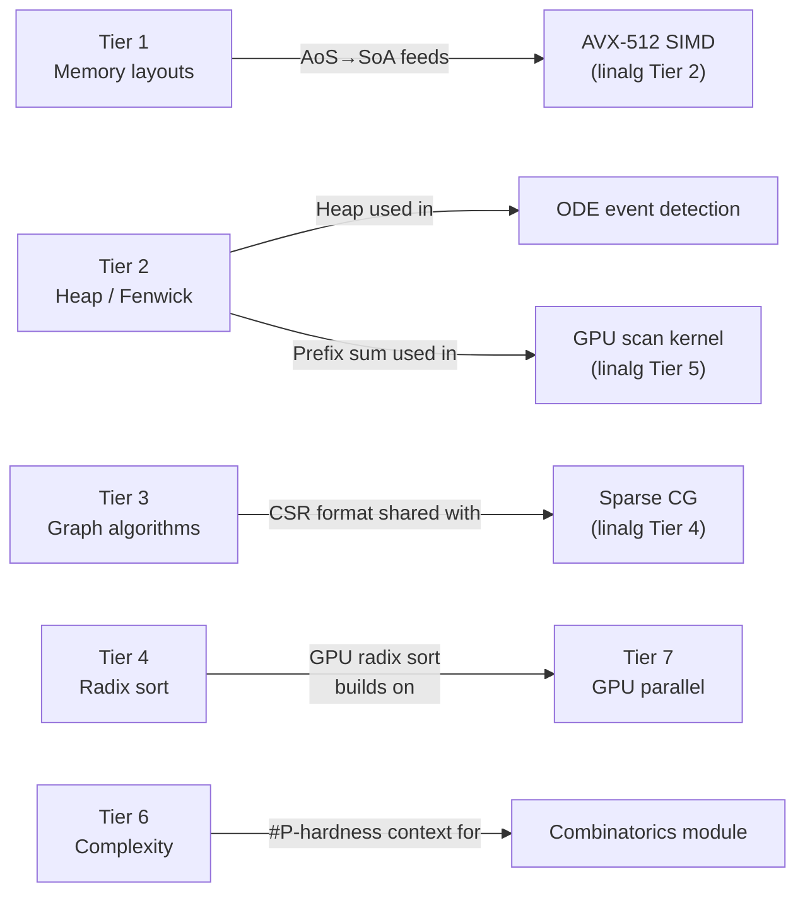

---
tags:
  - dsa
  - module
---

# DSA — Data Structures & Algorithms

> [!info] Framing
> You have a CS undergrad foundation — CLRS-level is assumed. The angle here is **performance, cache behavior, amortized analysis, and theory depth**, not "what is a binary tree."
> Each tier connects back to the math modules where relevant.

---

## Tiers

| Tier | Focus | Status |
|------|-------|--------|
| [[dsa/Tier 1 - Memory Aware Foundations\|Tier 1]] | AoS/SoA, ring buffer, Robin Hood hash, memory pool | ⬜ |
| [[dsa/Tier 2 - Trees & Range Structures\|Tier 2]] | Heap, Fenwick, segment tree, van Emde Boas, B-tree | ⬜ |
| [[dsa/Tier 3 - Graph Algorithms\|Tier 3]] | BFS/DFS, Dijkstra, Bellman-Ford, Floyd-Warshall, MST | ⬜ |
| [[dsa/Tier 4 - Sorting & Order Statistics\|Tier 4]] | Introsort, mergesort, radix sort, order statistics | ⬜ |
| [[dsa/Tier 5 - Advanced & Amortized\|Tier 5]] | Splay trees, skip lists, persistent DS, suffix arrays | ⬜ |
| [[dsa/Tier 6 - Paradigms & Complexity\|Tier 6]] | Master theorem, amortized analysis, randomized, NP, approximation | ⬜ |
| [[dsa/Tier 7 - GPU Parallel DSA\|Tier 7]] | Parallel scan, radix sort, BFS, GPU hash tables | ⬜ |

---

## Connections to Math Modules



---

## Namespace

```cpp
compute::dsa   // all data structure implementations
```

---

## References (quick links)

- Performance / cache → Drepper *What Every Programmer Should Know About Memory* (free)
- Algorithm depth → CLRS 4th ed, Skiena *Algorithm Design Manual* 3rd ed
- Theory → Arora & Barak *Computational Complexity* (free PDF)
- Full list → [[References#DSA — Data Structures and Algorithms]]
