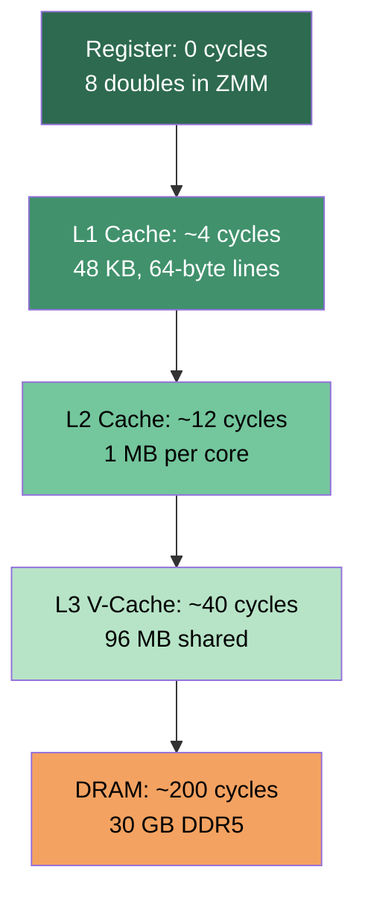
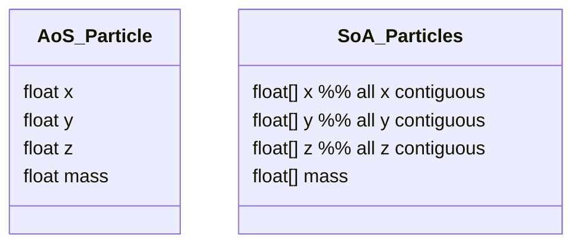

---
tags:
  - dsa
  - tier-1
  - cache
  - memory
  - simd
aliases:
  - dsa tier 1
---

# DSA Tier 1 — Memory-Aware Foundations

> [!tip] The core idea
> Every data structure is a memory access pattern. Before choosing an algorithm, choose a layout. Cache misses cost 200 cycles. An FLOP costs 0.25 cycles. The arithmetic is always the cheapest part.

Back to [[DSA]]

---

## Memory Access Costs (9800X3D)

**Rule of thumb**: one L3 miss = ~160 FLOPs wasted waiting.

---

## Checklist

- [ ] Array-of-Structs (AoS) vs Struct-of-Arrays (SoA) layout — cache line and SIMD analysis
- [ ] Ring buffer / circular queue — lock-free variant with `std::atomic`
- [ ] Robin Hood hash table — open addressing, backward-shift deletion
- [ ] Memory pool / slab allocator — replaces `malloc` in hot paths

---

## Key Formulas

**Cache line utilization** — fraction of a 64-byte line actually used per access

$$\text{AoS utilization} = \frac{\text{sizeof}(T_\text{field})}{\text{sizeof}(T_\text{struct})}$$

For a struct with 4 doubles where you only read one field:

$$\text{utilization} = \frac{8}{32} = 25\%\quad \text{(SoA gives 100\%)}$$

**Robin Hood max probe length** — expected maximum over $n$ insertions into table of size $m$

$$E[\text{max probe}] = O\!\left(\frac{\log n}{\log \log n}\right) \quad \text{vs } O(\log n) \text{ for standard open addressing}$$

**Memory pool allocation cost**

$$t_{\text{pool}} = O(1) \text{ (pointer bump)}, \qquad t_{\text{malloc}} = O(\log n) \text{ (free list search)}$$

---

## AoS vs SoA Layout

---

## Implementation Ideas

> [!example] AoS vs SoA — make it measurable
> Benchmark summing a single field across $10^7$ particles:
> - AoS: every particle struct loaded, only 25% of each cache line used
> - SoA: sequential reads, prefetcher works perfectly, AVX-512 loads 16 floats at once
>
> Expected speedup: 4–8× — demonstrate with `perf stat -e cache-misses`.

> [!example] Ring buffer — lock-free with `std::atomic`
> Head and tail as `std::atomic<size_t>`. Producer bumps tail, consumer bumps head.
> Use `memory_order_acquire` on load, `memory_order_release` on store.
> Key invariant: `(tail - head) <= capacity` at all times (power-of-two capacity enables masking).
> Post: the difference between `memory_order_relaxed`, `acquire/release`, and `seq_cst` — measured.

> [!example] Robin Hood hashing
> On insertion: if the current element has a shorter probe length than the one being inserted, swap them (steal from the rich, give to the poor — hence the name).
> Backward-shift deletion: instead of tombstones, shift elements back when deleting.
> Result: $O(1)$ amortized, lower variance than standard open addressing, cache-friendlier than chaining.
> Compare against `std::unordered_map` (chaining, pointer-heavy) — expect 3–5× throughput advantage.

> [!example] Memory pool / slab allocator
> Pre-allocate a large `aligned_buffer<T>` (from `compute::core`). Track free slots with a free list stack.
> Allocation = pop from stack ($O(1)$), deallocation = push to stack ($O(1)$).
> No fragmentation for fixed-size objects. Essential for node-based structures (trees, graphs).

---

## Post Ideas

> [!tip] LinkedIn angles for this tier

**Algorithm posts**
- "AoS vs SoA: a layout change that gave me $5\times$ speedup without changing the algorithm"
- "Robin Hood hashing: why your hash table probe lengths have high variance — and how to fix it"
- "Lock-free ring buffer: `memory_order_acquire/release` vs `seq_cst` — measured"

**C++ design posts**
- "Replacing `malloc` with a slab allocator in a hot path: from $O(\log n)$ to $O(1)$"
- "SoA with `std::mdspan` in C++23: zero-overhead multi-field arrays"
- "The cache line as a design constraint: struct layout for 64-byte alignment"

**Performance posts**
- "`perf stat -e cache-misses`: seeing AoS vs SoA in hardware counters"
- "One 64-byte cache line holds 8 doubles — designing around this number"

---

## Mathematical Depth

> [!note] Theory worth internalising
> - **Cache-oblivious model**: Frigo et al. 1999 — algorithm analysis without knowing cache size $M$ or line size $B$; optimal algorithms achieve $\Theta(n^3/B\sqrt{M})$ transfers for GEMM
> - **Robin Hood variance**: Celis et al. 1985 proved probe length variance is $O(1)$ vs $\Theta(\log n)$ for standard open addressing — the key theoretical advantage
> - **Memory order**: the C++ memory model is a partial order on operations; `acquire/release` establish happens-before without a full fence — formally defined in the C++11 standard §6.8.2

---

## References

> [!quote] Read before coding this tier
> - **Drepper** *What Every Programmer Should Know About Memory* (free) — §3, §6 — required
> - **Celis, Larson & Munro** "Robin Hood Hashing" FOCS 1985 (free) — the original paper
> - **Abseil Swiss Tables design doc** (free) — SIMD-accelerated hash table engineering

→ [[References#DSA — Data Structures and Algorithms]]
