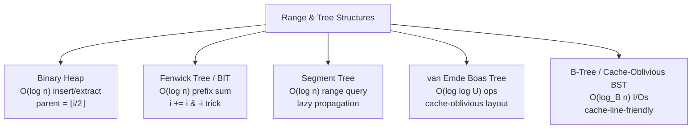
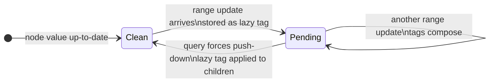

---
tags:
  - dsa
  - tier-2
  - trees
  - range-queries
aliases:
  - dsa tier 2
---

# DSA Tier 2 — Trees & Range Structures

> [!tip] The core idea
> Trees organize data hierarchically for $O(\log n)$ access. Range structures answer "what's the aggregate over $[l, r]$?" efficiently. Both are fundamental to the numerical modules: heaps appear in ODE event detection; Fenwick trees are the CPU analogue of the GPU scan.

Back to [[DSA]] | Prev: [[Tier 1 - Memory Aware Foundations]]

---

## Structure Taxonomy



---

## Checklist

- [ ] Binary min/max heap — `push`, `pop`, `heapify` in $O(\log n)$
- [ ] Fenwick tree (BIT) — prefix sum in $O(\log n)$, point update in $O(\log n)$
- [ ] Segment tree — range sum/min/max query with lazy propagation
- [ ] Van Emde Boas tree — $O(\log \log U)$ operations on integers in $[0, U)$
- [ ] B-tree with branching factor $B = 64/\text{sizeof}(key)$ — cache-line-sized nodes

---

## Key Formulas

**Binary heap** — 1-indexed array, parent / child relationships

$$\text{parent}(i) = \lfloor i/2 \rfloor, \quad \text{left}(i) = 2i, \quad \text{right}(i) = 2i+1$$

**Fenwick prefix sum** — responsible bit trick

$$\text{sum}(i) = \sum_{j=i-\text{lsb}(i)+1}^{i} a[j], \quad \text{lsb}(i) = i \,\&\, (-i)$$

Update: `i += i & -i` (walks up). Query: `i -= i & -i` (walks down).

**Segment tree node count** and space

$$\text{nodes} = 4n \quad \text{(safe upper bound for 1-indexed array)}$$

**Van Emde Boas recurrence** — $T(U)$ time for $U$-universe tree

$$T(U) = T(\sqrt{U}) + O(1) \implies T(U) = O(\log \log U)$$

**B-tree I/O complexity** — with block size $B$, branching factor $t = \Theta(B)$

$$O(\log_t n) = O\!\left(\frac{\log n}{\log B}\right) \text{ disk I/Os per operation}$$

For cache-oblivious BST: same bound achieved without knowing $B$.

---

## Segment Tree with Lazy Propagation



---

## Implementation Ideas

> [!example] Heap — the indexing trick
> Store as a 1-indexed array (waste index 0). Parent-child arithmetic is branchless integer math.
> For max-heap: `heap[parent(i)] >= heap[i]` invariant maintained by `sift_up` and `sift_down`.
> Used internally by Dijkstra (Tier 3) and ODE event detection (step-size priority queue).

> [!example] Fenwick tree — the `i & -i` trick explained
> `i & -i` isolates the lowest set bit of $i$. This is the key to why the tree works:
> - Update at $i$: move to `i + lsb(i)` (add the lowest set bit)
> - Query prefix $[1..i]$: move to `i - lsb(i)` (clear the lowest set bit)
> The tree implicitly stores partial sums aligned to powers of 2 — no explicit tree structure needed.
> Post: derive this from scratch. The bit trick is elegant and non-obvious.

> [!example] Lazy propagation — composable tags
> For a range-add operation: store `lazy[node] = delta`. When pushing down:
> ```
> lazy[left] += lazy[node]
> lazy[right] += lazy[node]
> lazy[node] = 0
> ```
> Key: tags must form a **monoid** under composition (associative, identity exists). Addition qualifies.
> For "range set then range add": tags compose as $(set, add)$ pairs with a defined composition rule.

> [!example] Van Emde Boas layout for cache-oblivious BST
> Lay out the tree in BFS order recursively: top half of the tree, then each subtree of the bottom half.
> This layout achieves $O(\log_B n)$ cache misses for any $B$ — no explicit block size needed.
> Post: derive the layout, measure cache misses vs standard BST layout.

---

## Post Ideas

> [!tip] LinkedIn angles for this tier

**Algorithm posts**
- "The Fenwick tree `i & -i` trick: a bit operation that implies a tree structure"
- "Lazy propagation in segment trees: why tags must form a monoid"
- "Van Emde Boas $O(\log \log U)$: the recurrence $T(U) = T(\sqrt{U}) + O(1)$ solved"
- "Cache-oblivious BST layout: $O(\log_B n)$ I/Os without knowing $B$"

**Math-depth posts**
- "The Fenwick tree is a partial order on binary representations — a number theory perspective"
- "$O(\log \log U)$ vs $O(\log n)$: when universe size matters more than element count"
- "B-tree branching factor as a cache-line design parameter: $t = \lfloor (B - \text{overhead}) / (\text{key} + \text{ptr}) \rfloor$"

**Performance posts**
- "Heap vs `std::priority_queue`: the layout is the same, the constant matters"
- "Fenwick vs segment tree for prefix sums: 3× faster in practice for simple aggregates"

---

## Mathematical Depth

> [!note] Theory worth internalising
> - **Heap correctness**: invariant is a partial order; heapify is $O(n)$ not $O(n \log n)$ — the sum $\sum_{h=0}^{\log n} \frac{n}{2^h} \cdot h = O(n)$ via geometric series
> - **Fenwick correctness**: the prefix sum identity $\text{sum}(i) = a[i] + \text{sum}(i - \text{lsb}(i))$ follows from the binary representation of $i$ and the structure of power-of-two intervals
> - **vEB recurrence**: $T(U) = T(\sqrt{U}) + O(1)$, change variables $u = \log U$ gives $S(u) = S(u/2) + O(1)$ → $S(u) = O(\log u) = O(\log \log U)$
> - **Segment tree space**: $4n$ nodes suffices because the tree has at most $2n$ leaves and $2n - 1$ internal nodes in a complete binary tree; the factor 4 handles 1-indexing overhead

---

## References

> [!quote] Read before coding this tier
> - **CLRS** 4th ed — Ch 6 (heapsort and heaps), Ch 17.1 (amortized analysis for Fenwick)
> - **Frigo et al.** "Cache-Oblivious Algorithms" FOCS 1999 (free) — vEB layout section
> - **Drepper** *What Every Programmer Should Know About Memory* (free) — §6: cache-friendly trees

→ [[References#DSA — Data Structures and Algorithms]]
