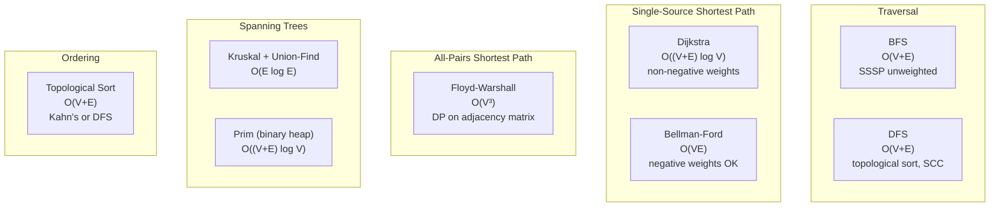
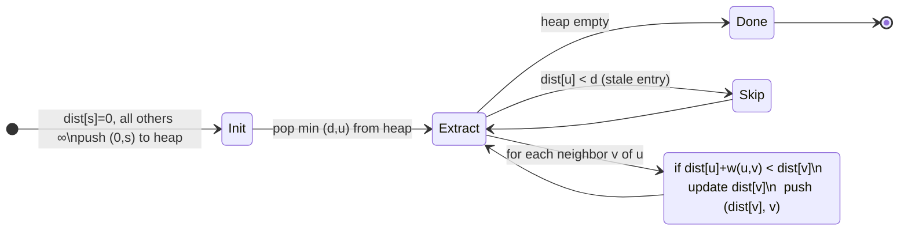

---
tags:
  - dsa
  - tier-3
  - graphs
  - shortest-paths
  - spanning-trees
aliases:
  - dsa tier 3
---

# DSA Tier 3 — Graph Algorithms

> [!tip] Connection to numerical modules
> Graph algorithms use **CSR (Compressed Sparse Row)** format — the same format as sparse matrices in the linear algebra module. Implementing both gives you the same data structure for two different algorithmic worlds.

Back to [[DSA]] | Prev: [[Tier 2 - Trees & Range Structures]]

---

## Algorithm Landscape



---

## Checklist

- [ ] BFS and DFS on CSR adjacency list
- [ ] Topological sort — Kahn's algorithm (BFS-based) and DFS variant
- [ ] Dijkstra with binary heap — `O((V+E) \log V)`
- [ ] Bellman-Ford — negative cycle detection in $O(VE)$
- [ ] Floyd-Warshall — all-pairs in $O(V^3)$, DP view
- [ ] Kruskal's MST + Union-Find with path compression and union by rank
- [ ] Prim's MST with priority queue

---

## Key Formulas

**CSR graph representation** — same format as sparse linalg matrices

$$\text{row\_ptr}[v]\ ..\ \text{row\_ptr}[v+1]-1 \quad \text{are the neighbor indices of vertex } v$$

Space: $O(V + E)$.

**Dijkstra correctness condition** — edge weights must be non-negative

$$w(u,v) \ge 0 \quad \forall (u,v) \in E$$

Time complexity with binary heap:

$$O\!\big((V + E)\log V\big)$$

With Fibonacci heap (theory only): $O(E + V \log V)$.

**Bellman-Ford** — $k$-th iteration relaxes paths with at most $k$ edges

$$d^{(k)}[v] = \min_{(u,v)\in E}\!\bigl(d^{(k-1)}[u] + w(u,v)\bigr)$$

Negative cycle detected if $d^{(V)}[v] < d^{(V-1)}[v]$ for any $v$.

**Floyd-Warshall recurrence** — DP over intermediate vertices

$$d_{ij}^{(k)} = \min\!\left(d_{ij}^{(k-1)},\; d_{ik}^{(k-1)} + d_{kj}^{(k-1)}\right)$$

**Union-Find complexity** — with path compression + union by rank

$$m \text{ operations on } n \text{ elements}: O(m \cdot \alpha(n))$$

where $\alpha$ is the **inverse Ackermann function** — effectively $O(1)$ for any realistic input.

---

## Dijkstra State Machine



---

## Implementation Ideas

> [!example] CSR — shared with sparse linalg
> The adjacency list in CSR is structurally identical to a sparse matrix row:
> ```cpp
> struct CSRGraph {
>     std::vector<int>    row_ptr;   // size V+1
>     std::vector<int>    col_idx;   // size E (neighbor indices)
>     std::vector<double> weights;   // size E (optional)
> };
> ```
> Reuse the same `CSRMatrix` type from the linear algebra module. Different semantics, same memory layout.

> [!example] Dijkstra — lazy deletion (no decrease-key)
> Standard implementation uses a min-heap with lazy deletion: push a new `(dist, v)` entry on each relaxation; skip entries where `d > dist[v]` when popping.
> This avoids implementing decrease-key (expensive in binary heaps). Works perfectly with `std::priority_queue`.
> Trade-off: heap may contain $O(E)$ entries instead of $O(V)$ — still $O((V+E)\log E)$ overall.

> [!example] Floyd-Warshall — DP on adjacency matrix
> Three nested loops, no data structure needed. The key is the DP interpretation:
> $d_{ij}^{(k)}$ = shortest path from $i$ to $j$ using only vertices $\{1, \ldots, k\}$ as intermediates.
> After $k = V$ iterations, $d_{ij}^{(V)}$ is the true shortest path.
> Post: relate this to matrix multiplication over the $(\min, +)$ semiring — the "tropical semiring."

> [!example] Union-Find — implement both optimizations
> Without optimizations: $O(n)$ per operation (degenerate chain).
> Path compression only: $O(\log n)$ amortized.
> Union by rank only: $O(\log n)$ amortized.
> Both together: $O(\alpha(n))$ — essentially constant.
> Post: measure all four variants. The inverse Ackermann speedup is visible at $n = 10^6$.

---

## Post Ideas

> [!tip] LinkedIn angles for this tier

**Algorithm posts**
- "Dijkstra's algorithm: why negative weights break it (and Bellman-Ford fixes it)"
- "Floyd-Warshall is matrix multiplication over the $(\min,+)$ tropical semiring"
- "Union-Find: the inverse Ackermann function and why it's effectively constant"
- "Kahn's topological sort: BFS with in-degree tracking — and why it detects cycles for free"

**Math-depth posts**
- "The tropical semiring $(\mathbb{R} \cup \{\infty\}, \min, +)$: Floyd-Warshall and shortest paths as linear algebra"
- "Menger's theorem: max-flow = min-cut, and why it's a graph theory duality"
- "Inverse Ackermann $\alpha(n)$: grows slower than $\log^* n$ — a function that's theoretically not constant but practically is"

**C++ design posts**
- "CSR adjacency list: the same data structure as a sparse matrix — one type, two uses"
- "Lazy deletion in Dijkstra: why we don't need `decrease-key` in practice"

---

## Mathematical Depth

> [!note] Theory worth internalising
> - **Dijkstra correctness**: by induction on the number of finalized vertices. The greedy choice is valid because non-negative edge weights mean the shortest path to $v$ can never be improved by going through a vertex with a larger tentative distance.
> - **Bellman-Ford**: the $k$-th iteration relaxes all paths of at most $k$ edges. By the triangle inequality, shortest paths in a graph with no negative cycles have at most $V-1$ edges.
> - **Tropical semiring**: the $(\min,+)$ semiring over $\mathbb{R} \cup \{\infty\}$ satisfies all semiring axioms. Floyd-Warshall is matrix "exponentiation" in this semiring: $D^{(k)} = D^{(k-1)} \otimes D$.
> - **Union-Find analysis**: Tarjan (1975) proved $O(m \alpha(n))$ using the potential method. The potential is a complex function of tree depths — one of the deepest amortized analysis proofs at the undergraduate level.

---

## References

> [!quote] Read before coding this tier
> - **CLRS** 4th ed — Ch 20–23 (elementary graph, DFS, BFS, shortest paths, MST)
> - **Tarjan, Robert E.** "Efficiency of a good but not linear set union algorithm" JACM 1975 — Union-Find amortized analysis
> - **Diestel** *Graph Theory* 5th ed (free PDF) — Ch 1–2 for formal foundations

→ [[References#DSA — Data Structures and Algorithms]]
