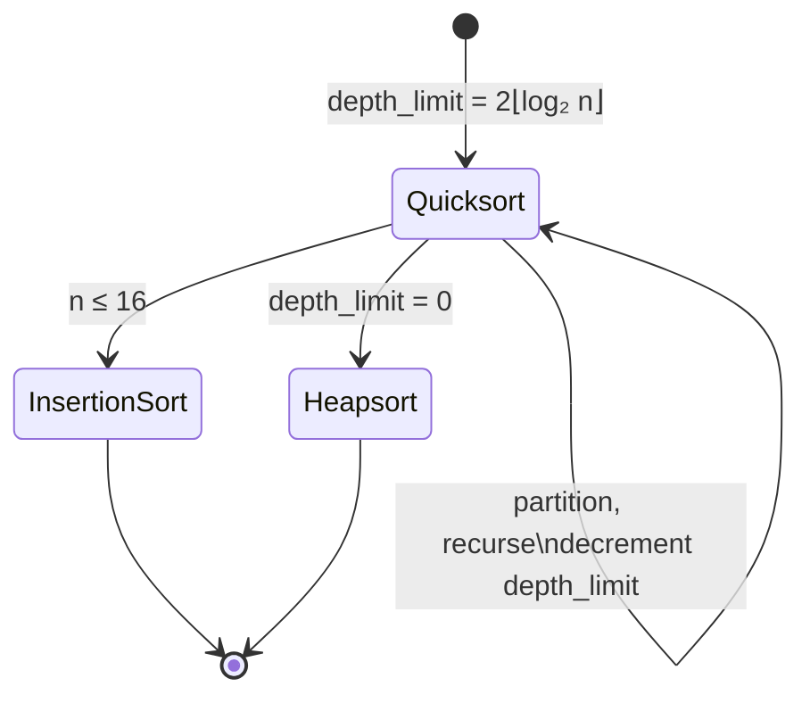

---
tags:
  - dsa
  - tier-4
  - sorting
  - order-statistics
aliases:
  - dsa tier 4
---

# DSA Tier 4 — Sorting & Order Statistics

> [!tip] The core idea
> Sorting is the most studied problem in algorithm design. The interesting questions at this level aren't "how do I sort?" — they're "why is this comparison lower bound tight?", "when does radix sort win?", and "how does cache behavior explain the constant factors?"

Back to [[DSA]] | Prev: [[Tier 3 - Graph Algorithms]]

---

## Sorting Algorithm Decision Tree

```mermaid
graph TD
    Q1{Integer keys?}
    Q1 -->|Yes| Q2{Key range U small?}
    Q1 -->|No| Q3{Size n large?}

    Q2 -->|U = O(n)| COUNT["Counting Sort\nO(n+U) — stable"]
    Q2 -->|U larger| RADIX["Radix Sort LSD\nO(d·n) — cache-friendly"]

    Q3 -->|"n > 10⁶"| MERGE["Mergesort\nO(n log n) — external, stable"]
    Q3 -->|Small-medium| INTRO["Introsort\nO(n log n) — what std::sort does"]

    INTRO --> QS["Quicksort\nrecursive, depth-monitored"]
    INTRO --> HS["Heapsort fallback\nO(n log n) worst-case"]
    INTRO --> IS["Insertion sort leaf\nn ≤ 16"]
```

---

## Checklist

- [ ] Introsort — quicksort + heapsort fallback + insertion sort leaf
- [ ] External mergesort — cache-oblivious merge, relevant for large datasets
- [ ] Radix sort LSD — integer keys, $O(dn)$, connects to GPU radix sort (Tier 7)
- [ ] Order statistics tree — augmented BST, $k$-th smallest in $O(\log n)$
- [ ] Median of medians — deterministic $O(n)$ selection, theory vs practice

---

## Key Formulas

**Comparison sort lower bound** — any comparison-based sort requires

$$\Omega(n \log n) \text{ comparisons}$$

Proof: the decision tree has $n!$ leaves, height $\ge \log_2(n!) = \Theta(n \log n)$ by Stirling.

**Stirling's approximation** — used in the lower bound proof

$$\log_2(n!) = \sum_{k=1}^n \log_2 k \approx n \log_2 n - n \log_2 e = \Theta(n \log n)$$

**Radix sort complexity** — $d$ passes over $n$ elements, each pass $O(n + 2^b)$ for $b$-bit digits

$$T(n) = O\!\left(\frac{w}{b} \cdot (n + 2^b)\right)$$

Optimal $b = \log_2 n$ gives $T(n) = O(wn / \log n)$ — beats comparison sort when $w = O(\log^2 n)$.

**Quicksort expected comparisons** — over random permutations

$$E[\text{comparisons}] = 2n \ln n \approx 1.386\, n \log_2 n$$

**Median of medians** — recurrence for $T(n)$ (select algorithm)

$$T(n) \le T(n/5) + T(7n/10) + O(n) \implies T(n) = O(n)$$

The $7n/10$ bound comes from at least $3n/10$ elements being eliminated per step.

---

## Introsort State Machine



---

## Implementation Ideas

> [!example] Introsort — what `std::sort` actually does
> Three algorithms composed:
> 1. **Quicksort** with median-of-3 pivot: expected $O(n \log n)$, good cache behavior
> 2. **Heapsort** fallback: triggered when recursion depth exceeds $2\lfloor \log_2 n \rfloor$ — prevents $O(n^2)$ worst case
> 3. **Insertion sort** leaf: for subarrays $\le 16$, insertion sort's low constant wins
>
> Post: profile each phase separately with Google Benchmark. Show insertion sort is faster than quicksort for $n \le 16$.

> [!example] Cache behavior of mergesort vs quicksort
> Mergesort: sequential reads and writes, prefetcher works well, stable. But: $O(n)$ extra space.
> Quicksort: partitioning accesses both ends of the array — prefetcher can't help as well. But: in-place.
> For external sort (data doesn't fit in RAM): mergesort wins unconditionally.
> Post: measure cache misses for both on $n = 10^7$ with `perf stat`.

> [!example] Radix sort — connects to GPU Tier 7
> LSD (Least Significant Digit) radix sort: process digit by digit from LSB to MSB.
> Each pass is a stable counting sort on one digit (e.g., 8-bit digit = 256 buckets).
> For 64-bit integers: 8 passes of 8-bit digits.
> Key: must use **stable** counting sort per pass to preserve relative order from earlier passes.
> GPU radix sort in Tier 7 is this algorithm parallelized — implement the CPU version here first.

> [!example] Median of medians — theory vs practice
> MoM guarantees $O(n)$ worst-case selection. In practice, it's slower than randomized quickselect due to large constants.
> Post: benchmark MoM vs `std::nth_element` (which uses introselect) on $n = 10^6$. Show theory-practice gap.
> The mathematical elegance of the $7n/10$ bound is worth a dedicated post.

---

## Post Ideas

> [!tip] LinkedIn angles for this tier

**Algorithm posts**
- "The $\Omega(n \log n)$ comparison sort lower bound: a decision tree argument from Stirling's formula"
- "Introsort: how `std::sort` combines three algorithms to get $O(n \log n)$ worst-case with fast constants"
- "Radix sort beats $O(n \log n)$ — but only when this condition on the key width holds"
- "Median of medians: $O(n)$ worst-case selection and why nobody uses it in production"

**Math-depth posts**
- "Stirling's approximation $\log(n!) \approx n \log n - n$ — and why it appears in sorting theory"
- "The optimal radix sort digit size is $b = \log_2 n$: a calculus minimization"
- "Randomized quicksort: why the expected $2n \ln n$ comparisons follows from harmonic numbers"

**Performance posts**
- "Cache behavior of mergesort vs quicksort: measured with `perf stat -e cache-misses`"
- "Insertion sort for $n \le 16$: why a quadratic algorithm beats $O(n \log n)$ at small sizes"

---

## Mathematical Depth

> [!note] Theory worth internalising
> - **Lower bound tightness**: heapsort achieves exactly $\Theta(n \log n)$ comparisons in the worst case, so the lower bound is tight
> - **Radix sort**: operates outside the comparison model — the lower bound doesn't apply. But it requires random access to counting arrays, which causes cache misses for large digit ranges. The optimal digit size balances passes vs cache misses.
> - **Quicksort average case**: the $2n H_n \approx 2n \ln n$ expected comparisons follow from $E[\text{comparisons}] = \sum_{i < j} \Pr[\text{i and j compared}] = 2 \sum_{i<j} \frac{1}{j-i+1} = 2n H_n$ where $H_n$ is the $n$-th harmonic number.
> - **Median of medians**: the $T(n) \le T(n/5) + T(7n/10) + O(n)$ recurrence is solved by showing $T(n) = cn$ for sufficiently large $c$ — a substitution proof.

---

## References

> [!quote] Read before coding this tier
> - **CLRS** 4th ed — Ch 8 (linear-time sorting), Ch 9 (medians and order statistics)
> - **Knuth** *TAOCP* Vol 3 §5 — the complete sorting treatment
> - **Sedgewick & Wayne** *Algorithms* 4th ed — Part II (practical sorting implementations)

→ [[References#DSA — Data Structures and Algorithms]]
