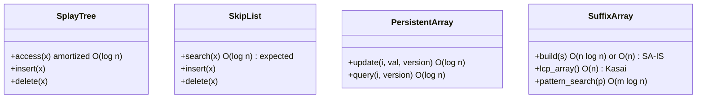
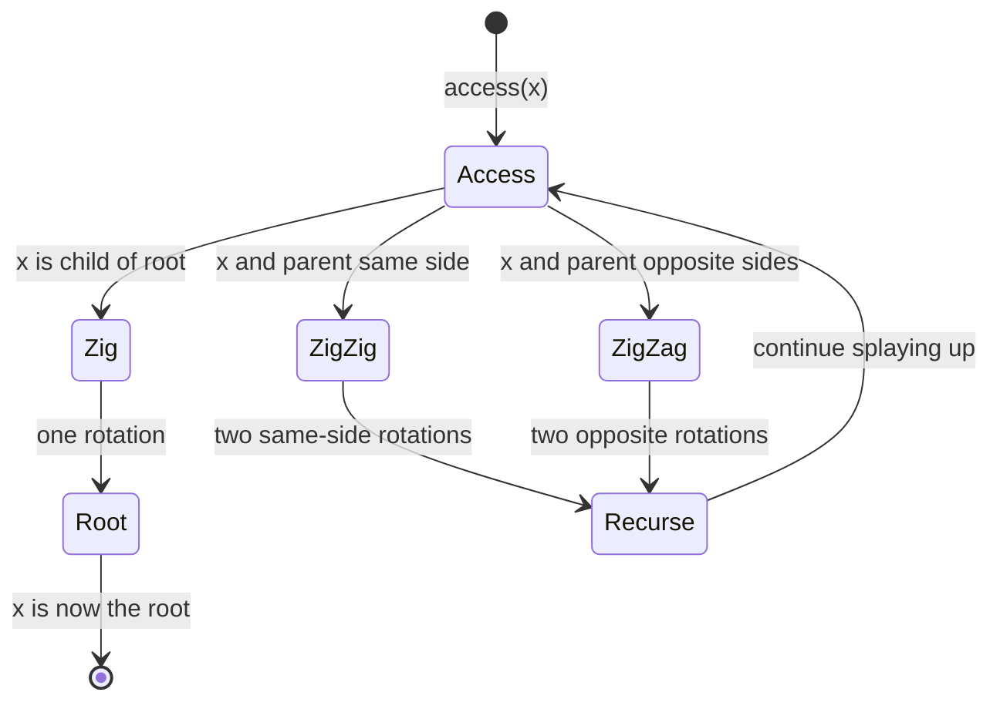

---
tags:
  - dsa
  - tier-5
  - amortized
  - advanced-structures
aliases:
  - dsa tier 5
---

# DSA Tier 5 — Advanced & Amortized

> [!tip] The core idea
> Amortized analysis lets expensive individual operations be "paid for" by cheap ones. This tier covers structures where the worst-case per-operation cost is high but the *average over a sequence* is optimal — and proving why requires the potential method.

Back to [[DSA]] | Prev: [[Tier 4 - Sorting & Order Statistics]]

---

## Structure Overview

---

## Checklist

- [ ] Union-Find amortized analysis — inverse Ackermann proof via potential method
- [ ] Splay trees — amortized $O(\log n)$, working set theorem
- [ ] Skip list — probabilistic $O(\log n)$, lock-free variant with atomics
- [ ] Persistent array — path copying on balanced BST, $O(\log n)$ per version
- [ ] Suffix array + LCP array — SA-IS $O(n)$ construction, Kasai's LCP algorithm

---

## Key Formulas

**Amortized analysis — potential method**

$$\hat{c}_i = c_i + \Phi(D_i) - \Phi(D_{i-1})$$

Total amortized cost bounds total real cost:

$$\sum_{i=1}^n c_i = \sum_{i=1}^n \hat{c}_i - \Phi(D_n) + \Phi(D_0) \le \sum_{i=1}^n \hat{c}_i + \Phi(D_0)$$

**Splay tree potential** — Tarjan & Sleator's potential function

$$\Phi(T) = \sum_{x \in T} \log(\text{size of subtree rooted at } x)$$

This yields amortized $O(\log n)$ per splay operation.

**Splay working set theorem** — if element $x$ was last accessed $t$ operations ago

$$\text{amortized cost of accessing } x = O(\log t)$$

Recently accessed elements are nearly $O(1)$ — self-adjusting behavior.

**Skip list expected height** — with promotion probability $p = 1/2$

$$E[\text{max level}] = O(\log n)$$

Expected search cost: $O(\log n)$ comparisons.

**Kasai LCP algorithm** — builds LCP array from suffix array in $O(n)$

$$\text{lcp}[i] = \text{length of longest common prefix of } \text{SA}[i] \text{ and } \text{SA}[i-1]$$

Key: if $\text{lcp}[\text{rank}[i]] = k > 0$, then $\text{lcp}[\text{rank}[i+1]] \ge k - 1$ — the LCP only decreases by 1 between adjacent suffixes, giving amortized $O(1)$ per step.

---

## Splay Tree Operation Flow

---

## Implementation Ideas

> [!example] Splay tree — the three rotation cases
> - **Zig**: $x$ is a child of root. One rotation.
> - **Zig-Zig**: $x$ and parent are both left (or both right) children. Rotate parent first, then $x$.
> - **Zig-Zag**: $x$ is left child of right child (or vice versa). Rotate $x$ twice.
>
> The zig-zig vs zig-zag distinction is crucial — it's what makes the amortized analysis work. Reversing them (doing zig-zag instead of zig-zig) breaks the $O(\log n)$ amortized bound.

> [!example] Skip list — probabilistic height
> Each element is promoted to the next level with probability $p = 1/2$.
> Expected number of levels: $O(\log n)$. Expected nodes at level $k$: $n/2^k$.
> Insert: flip coins to determine height, then update forward pointers at each level.
> Lock-free variant: use `std::atomic<Node*>` for forward pointers with CAS operations — post-worthy engineering.

> [!example] Persistent array — path copying
> Build on an implicit treap or weight-balanced BST.
> On update at index $i$: copy only the $O(\log n)$ nodes on the path from root to leaf $i$. Share all other nodes between versions.
> Space per update: $O(\log n)$. Query any historical version in $O(\log n)$.

> [!example] Suffix array — SA-IS algorithm
> SA-IS (Suffix Array Induced Sorting) builds the suffix array in $O(n)$ time and space.
> Key idea: classify suffixes as S-type (smaller than successor) or L-type, then induce the full order from a sampled suffix array.
> Kasai's LCP: use the fact that $\text{lcp}[\text{rank}[i+1]] \ge \text{lcp}[\text{rank}[i]] - 1$ to compute all LCP values in one left-to-right scan.

---

## Post Ideas

> [!tip] LinkedIn angles for this tier

**Algorithm posts**
- "Splay trees: why zig-zig and zig-zag are different — and why it matters for the amortized proof"
- "The working set theorem: recently accessed elements cost $O(\log t)$ — splay trees are self-optimizing"
- "Skip lists: a probabilistic alternative to balanced BSTs — and why they're easier to make lock-free"
- "Suffix arrays in $O(n)$: the SA-IS algorithm and Kasai's LCP trick"

**Math-depth posts**
- "The potential method for amortized analysis: $\hat{c}_i = c_i + \Delta\Phi$ — a formal derivation"
- "Splay tree potential $\Phi = \sum \log(\text{subtree size})$: why this specific function proves $O(\log n)$"
- "Skip list height is $O(\log n)$ with high probability — a probabilistic argument"

**C++ design posts**
- "Persistent data structures in C++: path copying with `std::shared_ptr` vs arena allocation"
- "Lock-free skip list: `std::atomic` CAS for concurrent forward pointer updates"

---

## Mathematical Depth

> [!note] Theory worth internalising
> - **Splay amortized proof**: Sleator & Tarjan 1985 define $\Phi(T) = \sum_x \log s(x)$ where $s(x)$ = subtree size of $x$. The access lemma proves the amortized cost of splaying $x$ from depth $d$ is $O(1 + \log(n/s(x)))$. The working set theorem follows as a corollary.
> - **Skip list correctness**: the expected cost is $O(\log n)$ because the expected number of nodes examined per level is $O(1)$ (geometric distribution), and there are $O(\log n)$ levels.
> - **SA-IS correctness**: the key insight is that L-type and S-type suffixes can be sorted independently given the LMS (Leftmost S) suffixes, and LMS suffixes can be sorted recursively on a compressed alphabet.
> - **Amortized vs worst-case**: amortized bounds say nothing about individual operations — a single splay on a pathological tree can take $O(n)$ time. Splay trees are inappropriate when you need bounded worst-case latency (e.g., real-time systems).

---

## References

> [!quote] Read before coding this tier
> - **Sleator & Tarjan** "Self-Adjusting Binary Search Trees" JACM 1985 (free) — the splay tree paper
> - **Tarjan** "Amortized Computational Complexity" SIAM 1985 (free) — potential method formalized
> - **CLRS** 4th ed — Ch 17: Amortized analysis (aggregate, accounting, potential methods)

→ [[References#DSA — Data Structures and Algorithms]]
