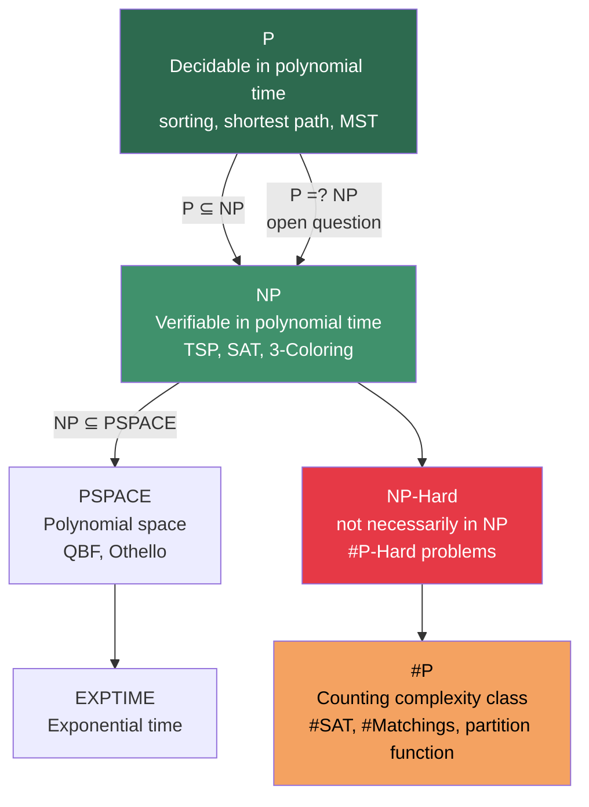
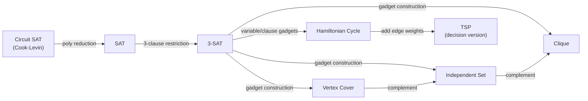

---
tags:
  - dsa
  - tier-6
  - complexity-theory
  - paradigms
  - theory
aliases:
  - dsa tier 6
---

# DSA Tier 6 — Paradigms & Complexity Theory

> [!tip] The core idea
> This tier is the theoretical backbone. With a math undergrad background you can read these proofs directly. The goal is fluency in the formal language — able to cite Cook-Levin, state #P-completeness, and explain why approximation algorithms exist for NP-hard problems.

Back to [[DSA]] | Prev: [[Tier 5 - Advanced & Amortized]]

---

## Complexity Class Hierarchy

---

## Checklist

- [ ] Master theorem — all three cases with examples
- [ ] Amortized analysis — aggregate, accounting, and potential method (formalize from Tier 5)
- [ ] Randomized algorithms — Las Vegas vs Monte Carlo, Markov and Chernoff bounds
- [ ] NP-completeness — Cook-Levin theorem, reductions, TSP/SAT/3-SAT
- [ ] #P-completeness — counting complexity, connection to partition function and combinatorics module
- [ ] Approximation algorithms — vertex cover ($2$-approx), set cover ($O(\log n)$-approx), FPTAS

---

## Key Formulas

**Master theorem** — recurrence $T(n) = aT(n/b) + f(n)$

$$T(n) = \begin{cases}
\Theta(n^{\log_b a}) & \text{if } f(n) = O(n^{\log_b a - \varepsilon}) \\
\Theta(n^{\log_b a} \log n) & \text{if } f(n) = \Theta(n^{\log_b a}) \\
\Theta(f(n)) & \text{if } f(n) = \Omega(n^{\log_b a + \varepsilon}) \text{ and regularity holds}
\end{cases}$$

**Strassen** fits case 1: $T(n) = 7T(n/2) + O(n^2)$, $\log_2 7 \approx 2.807 > 2$.

**Markov's inequality**

$$\Pr[X \ge t] \le \frac{E[X]}{t} \quad (X \ge 0)$$

**Chebyshev's inequality**

$$\Pr[|X - \mu| \ge k\sigma] \le \frac{1}{k^2}$$

**Chernoff bound** — for independent Bernoulli $X = \sum X_i$, $\mu = E[X]$

$$\Pr[X \ge (1+\delta)\mu] \le e^{-\mu\delta^2/3} \quad (0 < \delta \le 1)$$

**Approximation ratio** — for minimization problem with OPT value

$$\rho = \sup \frac{\text{ALG}(I)}{\text{OPT}(I)}$$

Vertex cover $2$-approximation: $\rho = 2$. Set cover: $\rho = H_n = \ln n + O(1)$.

---

## NP-Completeness Reduction Chain

---

## Implementation Ideas

> [!example] Master theorem — apply to all your algorithms
> Keep a running table: every recursive algorithm you write, apply the master theorem.
> - GEMM naive: $T(n) = 8T(n/2) + O(n^2)$ → Case 1, $T(n) = O(n^3)$
> - Strassen: $T(n) = 7T(n/2) + O(n^2)$ → Case 1, $T(n) = O(n^{2.807})$
> - Mergesort: $T(n) = 2T(n/2) + O(n)$ → Case 2, $T(n) = O(n \log n)$
> - Binary search: $T(n) = T(n/2) + O(1)$ → Case 2, $T(n) = O(\log n)$

> [!example] Chernoff bounds in practice — randomized algorithms
> You use Chernoff bounds when analyzing Monte Carlo algorithms: if each trial succeeds independently with probability $p$, after $k$ trials the failure probability is $e^{-kp^2/3}$ (for deviation $\delta = p$).
> Connection to MCMC module: Chernoff applies to the mixing of Markov chains (coupon collector, cover times).

> [!example] #P and the partition function
> Computing the number of partitions of $n$ is #P-complete in the general sense (for exponential alphabets).
> But $p(n)$ specifically is computable in $O(n^{3/2})$ via Euler's pentagonal theorem — because the problem has special structure.
> Post: the distinction between a specific counting problem being tractable and the general #P-hardness of counting.

> [!example] FPTAS — fully polynomial-time approximation scheme
> For the 0/1 knapsack problem: exact DP is $O(nW)$ (pseudo-polynomial). 
> FPTAS: scale weights by $\varepsilon$ to get integer weights of size $O(n/\varepsilon)$, run DP → $(1+\varepsilon)$-approximation in $O(n^2/\varepsilon)$.
> This shows some NP-hard problems admit arbitrarily good polynomial approximations — a fundamental result.

---

## Post Ideas

> [!tip] LinkedIn angles for this tier

**Algorithm posts**
- "The master theorem: every divide-and-conquer algorithm reduced to three cases"
- "Cook-Levin theorem: why SAT is NP-complete — the reduction from Turing machines"
- "NP vs #P: deciding that a solution exists vs counting how many — why counting is harder"

**Math-depth posts**
- "The Chernoff bound: exponential concentration from independence — a moment generating function argument"
- "Approximation algorithms and inapproximability: why you can't approximate clique better than $n^{1-\varepsilon}$ unless P=NP"
- "#P-completeness and the permanent: Valiant 1979 and counting perfect matchings"

**Theory posts**
- "The $\Omega(n \log n)$ sorting lower bound is tight — and this is a consequence of the decision tree model"
- "FPTAS for knapsack: a polynomial-time scheme that gets arbitrarily close to optimal"
- "Why TSP is NP-hard but the metric TSP has a $3/2$-approximation (Christofides)"

---

## Mathematical Depth

> [!note] Theory worth internalising
> - **Cook-Levin**: every NP problem reduces in polynomial time to Circuit-SAT. The proof encodes a non-deterministic Turing machine's computation as a circuit. This is the founding theorem of complexity theory.
> - **#P vs NP**: Toda's theorem states $\text{PH} \subseteq \text{P}^{\#\text{P}}$ — the entire polynomial hierarchy collapses to a single query to a #P oracle. Counting is strictly harder than deciding (under standard assumptions).
> - **Valiant 1979**: computing the permanent of a 0-1 matrix is #P-complete, while the determinant is computable in $O(n^3)$. These two seemingly similar problems have wildly different complexity.
> - **Chernoff vs CLT**: CLT gives convergence in distribution ($O(1/\sqrt{n})$ error). Chernoff gives exponential tail bounds ($e^{-\Omega(n\delta^2)}$ failure probability). For algorithms we need tail bounds, not convergence in distribution.

---

## References

> [!quote] Read before coding this tier
> - **CLRS** 4th ed — Ch 34 (NP-completeness), Ch 35 (approximation algorithms)
> - **Sipser** *Introduction to the Theory of Computation* 3rd ed — Ch 7–8
> - **Arora & Barak** *Computational Complexity* (free PDF) — Ch 1–2, Ch 16
> - **Motwani & Raghavan** *Randomized Algorithms* — Ch 1, Ch 3 (Chernoff bounds)

→ [[References#DSA — Data Structures and Algorithms]]
