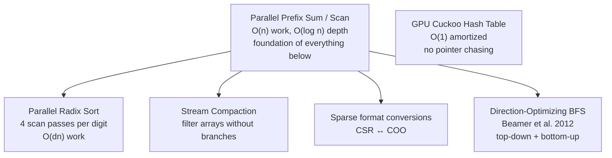
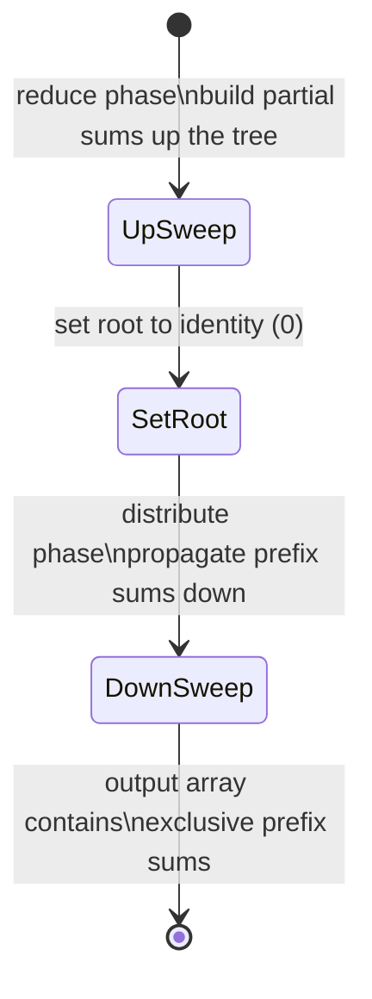

---
tags:
  - dsa
  - tier-7
  - cuda
  - gpu
  - parallel
aliases:
  - dsa tier 7
---

# DSA Tier 7 — GPU-Parallel DSA

> [!tip] The core idea
> GPU parallelism changes which data structures are efficient. Sequential structures (linked lists, pointer-based trees) are slow on GPU. Array-based, work-efficient parallel algorithms dominate. This tier bridges DSA and the CUDA work from [[linalg/Tier 5 - GPU|linalg Tier 5]].

Back to [[DSA]] | Prev: [[Tier 6 - Paradigms & Complexity]]

---

## GPU Parallel Algorithm Landscape



---

## Checklist

- [ ] Parallel prefix sum (scan) — Hillis-Steele and Blelloch work-efficient variants
- [ ] GPU parallel radix sort — 4 scan passes per 8-bit digit, full 64-bit sort
- [ ] Stream compaction — filter array by predicate, output-sensitive
- [ ] Direction-optimizing BFS — top-down vs bottom-up switching (Beamer et al. 2012)
- [ ] GPU cuckoo hash table — $O(1)$ amortized, no pointer chasing

---

## Key Formulas

**Parallel prefix sum — work and depth**

$$W = O(n), \quad D = O(\log n)$$

Hillis-Steele: $W = O(n \log n)$, $D = O(\log n)$ — not work-efficient.
Blelloch (up-sweep + down-sweep): $W = O(n)$, $D = O(\log n)$ — **work-efficient**.

**Parallel radix sort** — for $n$ elements with $w$-bit keys, $b$-bit digits per pass

$$\text{passes} = \lceil w/b \rceil, \quad \text{work per pass} = O(n + 2^b), \quad \text{total} = O\!\left(\frac{w}{b}(n + 2^b)\right)$$

Optimal on GPU: $b = 8$ (256 buckets, 32-bit key → 4 passes).

**BFS frontier size** — switching criterion (Beamer et al.)

$$\text{bottom-up if } |\text{frontier}| > \frac{m}{14\alpha}$$

where $m = |E|$ and $\alpha = 14$ empirically. Bottom-up avoids redundant edge checks when the frontier is large.

**GPU cuckoo hashing** — two hash functions $h_1, h_2$

$$\Pr[\text{insertion fails}] \le \frac{1}{n^c} \quad \text{for table load} \le 0.5$$

---

## Blelloch Scan (Work-Efficient)



**Up-sweep** (reduce): for $d = 0$ to $\log_2 n - 1$, each thread $k$ with $k \equiv 0 \pmod{2^{d+1}}$ computes:
$$x[k + 2^{d+1} - 1] \mathrel{+}= x[k + 2^d - 1]$$

**Down-sweep**: set $x[n-1] = 0$, then for $d = \log_2 n - 1$ down to $0$, swap and add.

---

## Implementation Ideas

> [!example] Hillis-Steele vs Blelloch — teach both
> **Hillis-Steele** (naive parallel scan):
> ```cuda
> for d = 1, 2, 4, ..., n/2:
>   if threadIdx >= d:
>     x[i] += x[i - d]   // O(n log n) total work
> ```
> **Blelloch** (work-efficient):
> Up-sweep builds a reduction tree ($O(n)$ work).
> Down-sweep distributes prefix sums ($O(n)$ work).
> Total: $O(n)$ work, $O(\log n)$ depth — optimal.
>
> Post: measure both. The Blelloch version is ~$\log n$ times more GPU-efficient.

> [!example] GPU radix sort — 4 passes
> For 32-bit integers: 4 passes of 8-bit digit.
> Each pass:
> 1. **Histogram**: each thread block counts occurrences of each digit value → 256-entry histogram per block
> 2. **Prefix sum**: scan the histograms to get global offsets for each digit value
> 3. **Scatter**: each element is placed at its output position based on its digit and prefix sum
>
> The prefix sum step is the scan from above — this is where the two implementations connect.

> [!example] Direction-optimizing BFS — the key insight
> **Top-down**: for each vertex in the frontier, check all its neighbors — $O(|E_\text{frontier}|)$.
> **Bottom-up**: for each unvisited vertex, check if any of its neighbors is in the frontier — also $O(|E_\text{frontier}|)$, but avoids re-examining already-visited neighbors.
>
> When the frontier is large (middle of BFS on a random graph), bottom-up has far fewer wasted checks. Switch strategy based on frontier size.

> [!example] GPU cuckoo hashing — no pointer chasing
> Two hash tables, two hash functions. Insert $x$: try $h_1(x)$; if occupied, evict and try $h_2$ of evicted; repeat until empty slot or cycle (rehash).
> Each lookup: exactly 2 memory accesses (check $h_1(x)$ and $h_2(x)$) — no chaining, no linked list traversal.
> This is the key GPU advantage: pointer chasing serializes access; cuckoo hashing has bounded, predictable memory access patterns.

---

## Post Ideas

> [!tip] LinkedIn angles for this tier

**Algorithm posts**
- "Blelloch scan: the work-efficient parallel prefix sum — and why Hillis-Steele wastes $O(n \log n)$ work"
- "GPU radix sort: 4 scan passes to sort $10^8$ integers in under 1 second"
- "Direction-optimizing BFS: Beamer et al.'s insight that cuts BFS time by $5\times$ for large graphs"
- "GPU cuckoo hashing: $O(1)$ lookup with exactly 2 memory accesses — no pointer chasing"

**Math-depth posts**
- "Work vs depth: the two measures of parallel algorithm complexity — and why both matter"
- "Brent's theorem: $T_p \le W/p + D$ — parallelism bounded by work per processor plus critical path"
- "Cuckoo hashing load factor $\le 0.5$ for $O(1)$ expected insertions — a probabilistic analysis"

**Performance posts**
- "GPU radix sort vs `std::sort`: 100× speedup at $n = 10^8$ — the chart"
- "Stream compaction on GPU: filtering without branches using prefix sums"

---

## Mathematical Depth

> [!note] Theory worth internalising
> - **Brent's theorem**: for a parallel algorithm with work $W$ and depth $D$, time on $p$ processors is $T_p \le W/p + D$. This formalizes the work-depth tradeoff.
> - **Blelloch correctness**: the up-sweep builds a complete binary tree of partial sums; the down-sweep correctly distributes prefix sums by maintaining the invariant that each node stores the sum of all elements to its left in the subtree.
> - **Cuckoo hashing probability**: with two independent hash functions and load factor $< 0.5$, the probability of insertion cycle is $O(1/n)$ per insertion, by a coupling argument on the random bipartite graph of key-slot assignments.
> - **BFS work**: top-down BFS is $O(V + E)$ total work but $\Omega(E)$ in the worst case for a single step. Direction-optimizing BFS achieves $O(V + E)$ with better constants — proven via frontier analysis.

---

## References

> [!quote] Read before coding this tier
> - **Kirk & Hwu** *Programming Massively Parallel Processors* 4th ed — Ch 10 (reduction/scan), Ch 13 (sorting)
> - **Beamer, Asanović & Patterson** "Direction-Optimizing BFS" SC 2012 (free) — read before BFS
> - **Blelloch** "Prefix Sums and Their Applications" 1990 CMU tech report (free) — the scan paper

→ [[References#HPC SIMD and CUDA]]
