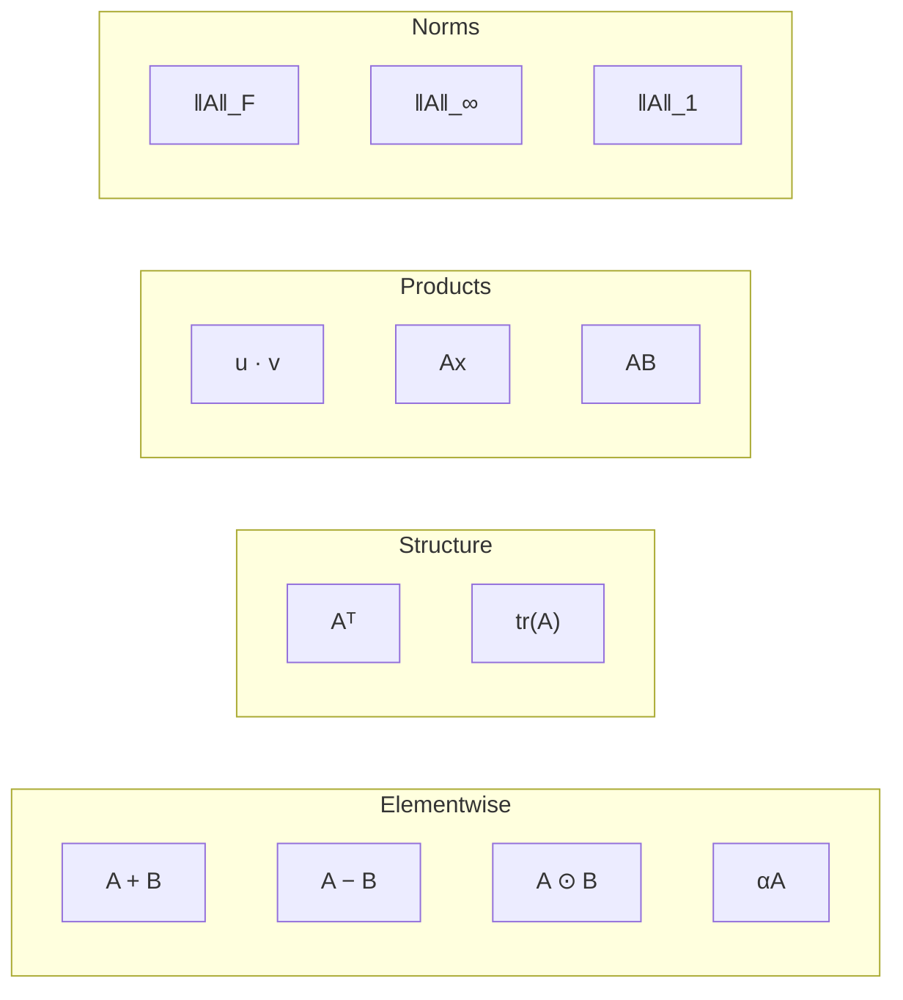
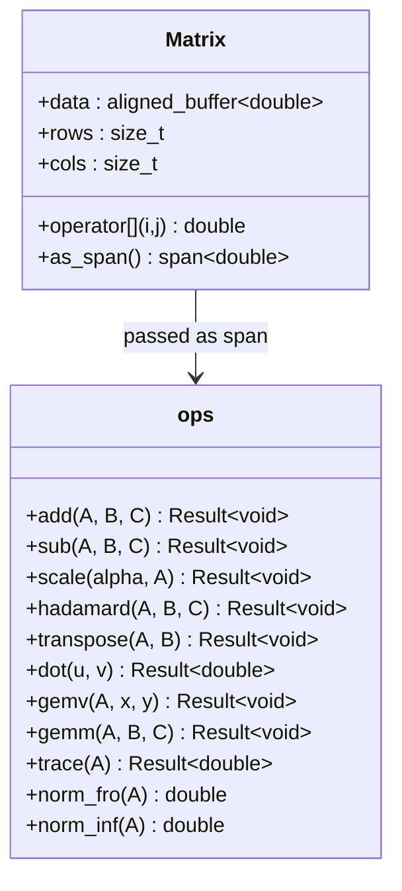

---
tags:
  - linear-algebra
  - tier-1
  - current
aliases:
  - linalg tier 1
---

# Tier 1 — Fundamentals

> [!tip] Why start here
> These are the primitives every higher-level algorithm calls internally. Getting the interface right — memory layout, const-correctness, `std::span`-based contracts — means all future tiers inherit clean foundations.

Back to [[Linear Algebra]]

---

## Operations at a Glance



---

## Checklist

- [ ] Matrix addition / subtraction — $A + B$, $A - B$
- [ ] Scalar multiplication — $\alpha A$
- [ ] Element-wise (Hadamard) product — $A \odot B$
- [ ] Matrix transpose — $A^\top$, in-place for square, out-of-place for rectangular
- [ ] Dot product — $\langle u, v \rangle = u^\top v$
- [ ] Matrix-vector multiply — $Ax$
- [ ] Matrix-matrix multiply (naive triple loop) — $C = AB$
- [ ] Trace — $\operatorname{tr}(A) = \sum_i a_{ii}$
- [ ] Frobenius norm — $\|A\|_F$
- [ ] Infinity norm — $\|A\|_\infty$
- [ ] 1-norm — $\|A\|_1$

---

## Key Formulas

**Frobenius norm**

$$\|A\|_F = \sqrt{\sum_{i=1}^{m} \sum_{j=1}^{n} a_{ij}^2} = \sqrt{\operatorname{tr}(A^\top A)}$$

**Infinity norm** (max absolute row sum)

$$\|A\|_\infty = \max_{1 \le i \le m} \sum_{j=1}^{n} |a_{ij}|$$

**1-norm** (max absolute column sum)

$$\|A\|_1 = \max_{1 \le j \le n} \sum_{i=1}^{m} |a_{ij}|}$$

**Naive GEMM** — $C = AB$ where $A \in \mathbb{R}^{m \times k}$, $B \in \mathbb{R}^{k \times n}$

$$c_{ij} = \sum_{p=1}^{k} a_{ip} \, b_{pj}, \quad \text{cost} = 2mnk \text{ FLOPs}$$

**Norm equivalence bounds** (useful for error analysis in Tier 3)

$$\|A\|_2 \le \|A\|_F \le \sqrt{n}\,\|A\|_2$$

---

## C++ Interface Pattern



---

## Implementation Ideas

> [!example] Loop order for GEMM
> The naive `i-j-k` loop strides across columns of $B$ — a cache miss every 8 doubles.
> This is intentional: write the most readable version first. It becomes the benchmark baseline for Tier 2.
> ```cpp
> for (size_t i = 0; i < m; ++i)
>   for (size_t j = 0; j < n; ++j)
>     for (size_t p = 0; p < k; ++p)
>       C[i*n+j] += A[i*k+p] * B[p*n+j];  // B access is stride-n
> ```

> [!example] Transpose — two versions
> - **Out-of-place**: `B[j*m + i] = A[i*n + j]` — correct, cache-unfriendly on the write
> - **In-place square**: 4-cycle algorithm with `std::swap` — no allocation
>
> The cache miss pattern of naive transpose is the teaser for Tier 2's tiled transpose.

> [!example] Frobenius norm — stable vs unstable
> Naïve accumulation overflows for large $|a_{ij}|$ before the `sqrt`. Use compensated summation (Neumaier) or column-major loop order to stay cache-warm *and* reduce error.
> Demonstrate the failure on values near $10^{154}$ (squaring overflows `double`).

> [!example] Norm equivalence as a sanity check
> After implementing all three norms, add a test that verifies $\|A\|_F \le \sqrt{n}\,\|A\|_2$ using the power-iteration $\|A\|_2$ estimate from Tier 4. Connects the tiers.

---

## Post Ideas

> [!tip] LinkedIn angles for this tier

**Algorithm posts**
- "The four matrix norms and the one inequality that connects them all: $\|A\|_2 \le \|A\|_F \le \sqrt{n}\|A\|_2$"
- "Why $\|A\|_F^2 = \operatorname{tr}(A^\top A)$ — the Frobenius norm is a dot product in disguise"
- "Hadamard vs matrix multiply: when element-wise is the right answer"

**C++ design posts**
- "Zero-allocation matrix ops: designing with `std::span` and `std::mdspan`"
- "`std::expected<T,E>` in a math library — monadic error handling for linear algebra"
- "In-place vs out-of-place transpose: an interface design decision"

**Performance posts**
- "My naive GEMM does 2 GFLOPS. Here's the number it *should* hit. *(Tier 2 teaser)*"
- "Why matrix-vector multiply is memory-bound — the roofline model for `Ax`"

---

## Mathematical Depth

> [!note] Connections worth internalizing
> - The dot product is the fundamental operation — GEMM, norms, and projections all reduce to repeated dot products
> - $\operatorname{tr}(AB) = \operatorname{tr}(BA)$ even when $AB \ne BA$ — the trace is cyclic
> - Transpose is an anti-homomorphism: $(AB)^\top = B^\top A^\top$
> - Hadamard product is commutative and associative; it is **not** the same as matrix multiplication

---

## References

> [!quote] Read before coding this tier
> - **Strang** *Introduction to Linear Algebra* 5th ed — Ch 1–3
> - **MIT OCW 18.06** (free) — Lectures 1–6
> - **Lay** *Linear Algebra and Its Applications* — Ch 2.1–2.3

→ [[References#Linear Algebra — Fundamentals]]
