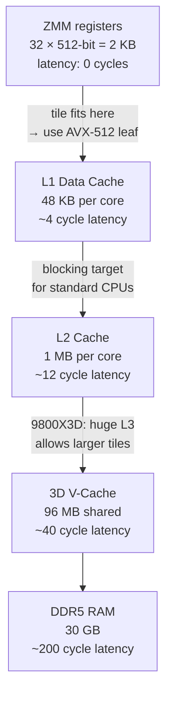

---
tags:
  - linear-algebra
  - tier-2
  - performance
  - simd
  - cache
aliases:
  - linalg tier 2
---

# Tier 2 — Performance

> [!tip] The core idea
> The math doesn't change. The memory access pattern does. This tier is a systematic climb up the performance ladder — one hardware constraint at a time.

Back to [[Linear Algebra]] | Prev: [[Tier 1 - Fundamentals]]

---

## Optimization Progression

```mermaid
stateDiagram-v2
    direction LR
    [*] --> Naive : i-j-k loop\n~2 GFLOPS
    Naive --> LoopReorder : swap to i-k-j\n~18 GFLOPS
    LoopReorder --> Tiled : block for L1 cache\n~95 GFLOPS
    Tiled --> AVX512 : FMA intrinsics leaf\n~220 GFLOPS
    AVX512 --> CacheOblivious : recursive subdivision\n~310 GFLOPS
    CacheOblivious --> Strassen : 7-multiply trick\n~380 GFLOPS
```



---

## Checklist

- [ ] Loop-reordered GEMM — `i-k-j` order, column-major reads of $B$
- [ ] Tiled / blocked GEMM — L1 tile sizing for the 9800X3D
- [ ] Tiled in-place transpose — block size = 64 bytes = 8 doubles
- [ ] AVX-512 FMA leaf kernel — manual `_mm512_fmadd_pd` intrinsics
- [ ] Cache-oblivious recursive GEMM — no explicit tile size, recurse until L1-fit
- [ ] Strassen algorithm — 7-multiply recursive scheme, crossover at $n \approx 512$

---

## Key Formulas

**GEMM FLOP count** — for $C = AB$, $A \in \mathbb{R}^{m \times k}$, $B \in \mathbb{R}^{k \times n}$

$$\text{FLOPs} = 2mnk \quad \Rightarrow \quad \text{GFLOPS} = \frac{2mnk}{t \times 10^9}$$

**Theoretical AVX-512 FP64 peak** on a single core at 4 GHz

$$\underbrace{8}_{\text{doubles/reg}} \times \underbrace{2}_{\text{FMA}} \times \underbrace{4 \times 10^9}_{\text{Hz}} = 64 \;\text{GFLOPS/core}$$

**Cache complexity of GEMM** — optimal for cache size $M$

$$Q(n) = \Theta\!\left(\frac{n^3}{\sqrt{M}}\right)$$

Cache-oblivious GEMM achieves this bound *without knowing $M$*.

**Strassen recurrence** — 7 multiplications instead of 8 for $2 \times 2$ blocks

$$T(n) = 7\,T(n/2) + O(n^2) \implies T(n) = O(n^{\log_2 7}) \approx O(n^{2.807})$$

**Strassen intermediate matrices** — for $C = AB$ split into $2 \times 2$ blocks

$$\begin{aligned}
M_1 &= (A_{11}+A_{22})(B_{11}+B_{22}) \\
M_2 &= (A_{21}+A_{22})B_{11} \\
M_3 &= A_{11}(B_{12}-B_{22}) \\
M_4 &= A_{22}(B_{21}-B_{11}) \\
M_5 &= (A_{11}+A_{12})B_{22} \\
M_6 &= (A_{21}-A_{11})(B_{11}+B_{12}) \\
M_7 &= (A_{12}-A_{22})(B_{21}+B_{22})
\end{aligned}$$

---

## Cache Hierarchy on the 9800X3D



> [!note] 9800X3D tile sizing
> Standard advice targets 48 KB (L1). The 96 MB V-Cache on the 9800X3D means larger tile sizes stay warm in L3 — the empirical optimum is larger than textbook values. Measure tile sizes 32×32 through 256×256 and plot GFLOPS.

---

## Implementation Ideas

> [!example] Why loop order is the first fix
> Naive `i-j-k`: inner loop accesses $B[p \cdot n + j]$ with stride $n$ — one cache miss per iteration.
> Reorder to `i-k-j`: inner loop accesses $B[p \cdot n + j]$ with stride 1 — sequential reads.
> Same 3 loops, 8–10× more cache-efficient. No SIMD needed. This alone is a post.

> [!example] AVX-512 FMA leaf
> When submatrix fits in L1, compute with 8-wide FMAs:
> ```cpp
> __m512d c0 = _mm512_load_pd(&C[i*n + j]);
> __m512d a  = _mm512_set1_pd(A[i*k + p]);
> __m512d b  = _mm512_load_pd(&B[p*n + j]);
> c0 = _mm512_fmadd_pd(a, b, c0);
> _mm512_store_pd(&C[i*n + j], c0);
> ```
> Requires 64-byte alignment — enforced by `aligned_buffer<double, 64>` from `compute::core`.

> [!example] Strassen numerical stability caveat
> Strassen accumulates more floating-point error than standard GEMM because the intermediate matrices involve subtractions. For ill-conditioned problems:
> $$\kappa(A) \gg 1 \implies \text{use standard GEMM, not Strassen}$$
> Document this clearly. It's a great post: "when the faster algorithm is wrong."

---

## Post Ideas

> [!tip] LinkedIn angles for this tier

**Algorithm posts**
- "Loop order is the most important GEMM optimization — before SIMD, before tiling"
- "Cache-oblivious algorithms: how $Q(n) = \Theta(n^3/\sqrt{M})$ happens automatically"
- "Strassen: I measured the crossover at $n \approx 512$ on Zen 5. Here's the chart and why."
- "$O(n^{2.807})$ vs $O(n^3)$: when does the asymptotic advantage actually appear?"

**C++ design posts**
- "Manual AVX-512 intrinsics vs compiler autovectorization: a side-by-side comparison"
- "`constexpr` tile sizes with `simd_traits<T>::width` — zero-cost tile configuration"
- "Recursive GEMM: a 15-line divide-and-conquer that beats hand-tuned loops"

**Performance posts**
- "Naive → loop reorder → tiled → AVX-512 → cache-oblivious: the full GFLOPS climb"
- "`perf stat` cache-miss counts: seeing why loop order matters in hardware counters"
- "Strassen is numerically less stable — benchmarking the accuracy cost of $2\times$ speed"

---

## Mathematical Depth

> [!note] Theory worth internalising
> - Cache-oblivious algorithms achieve optimal $\Theta(n^3/\sqrt{M})$ cache complexity without knowing $M$ — proven via the *tall-cache assumption* in Frigo et al. 1999
> - Strassen's 7-formula identity is a consequence of the fact that $2\times2$ matrix multiplication over a ring has multiplicative complexity exactly 7 (Hopcroft & Kerr, 1971)
> - The current best known matrix multiplication exponent is $\omega < 2.371552$ (Duan–Wu–Zhou 2023) — impractical, but a great post hook
> - AVX-512 FMA instruction performs $a \leftarrow a + b \cdot c$ in one cycle — 2 FLOPs per cycle per lane

---

## References

> [!quote] Read before coding this tier
> - **Drepper** *What Every Programmer Should Know About Memory* (free) — §3, §6
> - **Frigo et al.** "Cache-Oblivious Algorithms" FOCS 1999 (free) — read before recursive GEMM
> - **Intel Intrinsics Guide** (free) — every `_mm512_*` call
> - **Agner Fog** Optimization Manuals (free) — Zen 5 instruction latencies

→ [[References#HPC SIMD and CUDA]]
