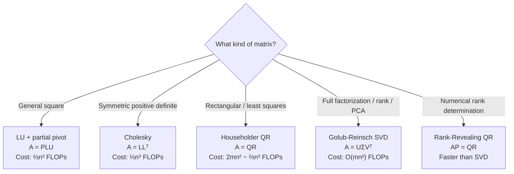
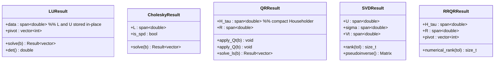

---
tags:
  - linear-algebra
  - tier-3
  - decompositions
  - numerical
aliases:
  - linalg tier 3
---

# Tier 3 — Decompositions

> [!tip] The core idea
> Every practical linear algebra computation reduces to a factorization. This tier is where the engine becomes useful for real problems.

Back to [[Linear Algebra]] | Prev: [[Tier 2 - Performance]]

---

## Which Decomposition for Which Problem

---

## Checklist

- [ ] LU decomposition with partial pivoting — $A = PLU$
- [ ] Forward / backward substitution — triangular solves from LU
- [ ] Cholesky factorization for SPD systems — $A = LL^\top$
- [ ] Householder QR — compact $(H, \tau)$ representation
- [ ] `apply_Q` and `apply_Qᵀ` — apply without forming $Q$ explicitly
- [ ] Thin SVD via Golub-Reinsch bidiagonalization
- [ ] Rank-revealing QR with column pivoting — $AP = QR$

---

## Key Formulas

**LU decomposition**

$$A = PLU, \quad \text{solve } Ax=b \text{ via } L(Ux) = Pb$$

Cost: $\dfrac{2}{3}n^3$ FLOPs. Growth factor bound: $g \le 2^{n-1}$ (worst case), $O(n^{2/3})$ in practice.

**Cholesky** — exists iff $A \succ 0$ (symmetric positive definite)

$$A = LL^\top, \quad l_{jj} = \sqrt{a_{jj} - \sum_{k=1}^{j-1} l_{jk}^2}$$

Cost: $\dfrac{1}{3}n^3$ FLOPs — exactly **2× faster** than LU.

**Householder reflector** — zeros out elements below the diagonal in column $j$

$$H = I - \tau v v^\top, \quad \tau = \frac{2}{v^\top v}, \quad v = x \pm \|x\|_2 e_1$$

QR stores the $(v, \tau)$ pairs compactly — never forms the $n \times n$ matrix $Q$ explicitly.

**Thin SVD**

$$A = U \Sigma V^\top, \quad A \in \mathbb{R}^{m \times n},\; m \ge n$$
$$U \in \mathbb{R}^{m \times n},\quad \Sigma = \operatorname{diag}(\sigma_1 \ge \cdots \ge \sigma_n \ge 0),\quad V \in \mathbb{R}^{n \times n}$$

**Eckart-Young theorem** — best rank-$k$ approximation in 2-norm and Frobenius norm:

$$\min_{\operatorname{rank}(B)=k} \|A - B\|_2 = \sigma_{k+1}, \qquad \min_{\operatorname{rank}(B)=k} \|A - B\|_F = \sqrt{\sigma_{k+1}^2 + \cdots + \sigma_n^2}$$

**Norm-equivalence connections** from SVD

$$\|A\|_2 = \sigma_1, \qquad \|A\|_F = \sqrt{\sum_i \sigma_i^2}, \qquad \|A\|_* = \sum_i \sigma_i$$

---

## Decomposition Internals

---

## Implementation Ideas

> [!example] LU — panel factorization
> Don't factorize column-by-column. Use **panel factorization**: factorize a block of $b$ columns (using BLAS-1/2), then update the trailing $(n-b) \times (n-b)$ submatrix with a single GEMM call (Tier 2).
> This converts LU from BLAS-2 to BLAS-3 — the difference between 30 GFLOPS and 300 GFLOPS.

> [!example] Cholesky — SPD check is free
> During factorization, if $a_{jj} - \sum_k l_{jk}^2 < 0$, the matrix is not SPD.
> Return an error via `Result<CholeskyResult>` with `ErrorCode::not_spd`.
> No extra computation — the check is a by-product of the algorithm.

> [!example] Householder QR — never form Q
> $Q$ is $m \times m$ and dense — forming it costs $O(m^2 n)$ FLOPs and $m^2$ memory.
> Instead, store $(v_j, \tau_j)$ for each step $j = 1, \ldots, n$.
> `apply_Qᵀ b` applies reflectors left-to-right in $O(mn)$; `apply_Q b` right-to-left.
> This is exactly what LAPACK `dgeqrf` returns. Explain the connection in the post.

> [!example] SVD — Golub-Reinsch two phases
> **Phase 1 — Bidiagonalization**: apply Householder reflectors alternately from left and right to get $A = U_0 B V_0^\top$ where $B$ is upper bidiagonal. Cost: $O(mn^2)$.
> **Phase 2 — QR iteration on B**: apply implicit QR shifts to the bidiagonal matrix until off-diagonal entries vanish. Each step costs $O(n)$.
> The singular values emerge on the diagonal; $U$ and $V$ accumulate the transformations.

---

## Post Ideas

> [!tip] LinkedIn angles for this tier

**Algorithm posts**
- "LU decomposition from scratch — why partial pivoting is not optional (growth factor demo)"
- "Cholesky is twice as fast as LU: $\frac{1}{3}n^3$ vs $\frac{2}{3}n^3$ FLOPs — and here's the intuition"
- "Why we never form $Q$ in Householder QR — the compact $(H, \tau)$ representation"
- "SVD from scratch — bidiagonalization, Golub-Reinsch, and what your PCA library hides"
- "The Eckart-Young theorem: why SVD gives the best low-rank approximation"

**C++ design posts**
- "Panel factorization: the design pattern that turns LU from BLAS-2 to BLAS-3"
- "Compact QR storage: Householder reflectors as `(v, tau)` pairs in C++23"
- "Encoding decomposition results as types: `LUResult`, `SVDResult` with `std::expected`"

**Math-depth posts**
- "Condition numbers: why your LU solution can be garbage even when the algorithm is correct"
- "$\|A\|_2 = \sigma_1$, $\|A\|_F = \sqrt{\sum \sigma_i^2}$ — the singular value interpretation of matrix norms"
- "The four matrix norms unified through SVD"

---

## Mathematical Depth

> [!note] Theory worth internalising
> - **LU** growth factor: $2^{n-1}$ worst case (Hadamard matrix), $O(n^{2/3})$ in practice — Wilkinson's backward stability analysis
> - **Cholesky** exists iff $A \succ 0$; the algorithm is a constructive proof of this equivalence
> - **QR**: Householder is backward stable; classical Gram-Schmidt is *not* (rounding errors cause loss of orthogonality). Modified Gram-Schmidt is better but still not backward stable. Always prefer Householder.
> - **SVD**: $\sigma_i(A) = \sqrt{\lambda_i(A^\top A)}$ — singular values are square roots of eigenvalues of the Gram matrix
> - **Pseudoinverse**: $A^+ = V \Sigma^+ U^\top$ where $\Sigma^+$ inverts nonzero singular values

---

## References

> [!quote] Read before coding this tier
> - **Trefethen & Bau** *Numerical Linear Algebra* — Lectures 7–11 (QR), 20–22 (LU), 31 (SVD)
> - **Golub & Van Loan** *Matrix Computations* 4th ed — Ch 3.4, Ch 5, Ch 8.6
> - **Golub & Reinsch** "Singular Value Decomposition" Numer. Math. 1970 — the original paper

→ [[References#Linear Algebra — Decompositions]]
