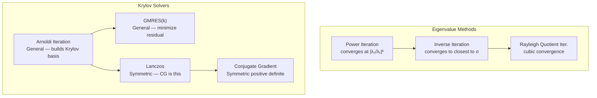
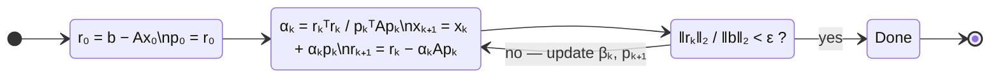

---
tags:
  - linear-algebra
  - tier-4
  - eigenvalues
  - iterative-solvers
  - krylov
aliases:
  - linalg tier 4
---

# Tier 4 — Eigenvalues & Iterative Solvers

> [!tip] The core idea
> Direct methods (Tier 3) have fixed cost and exact answers. Iterative methods trade exactness for scalability. For sparse $n \times n$ systems where $n > 10^5$, iteration is the only option — forming the full matrix isn't even possible.

Back to [[Linear Algebra]] | Prev: [[Tier 3 - Decompositions]]

---

## Algorithm Family Tree



---

## Checklist

- [ ] Power iteration — dominant $(\lambda_1, v_1)$
- [ ] Inverse iteration — eigenvalue closest to shift $\sigma$
- [ ] Rayleigh quotient iteration — cubic convergence via adaptive shift
- [ ] Conjugate Gradient for sparse $Ax = b$ (CSR format)
- [ ] Arnoldi iteration — orthonormal Krylov basis
- [ ] GMRES($k$) — restart after $k$ steps, minimize $\|r_k\|_2$

---

## Key Formulas

**Power iteration** — converges to $(\lambda_1, v_1)$

$$v^{(k+1)} = \frac{Av^{(k)}}{\|Av^{(k)}\|_2}, \qquad \text{rate: } \left|\frac{\lambda_2}{\lambda_1}\right|^k$$

**Rayleigh quotient** — stationary at eigenvectors, updated each step

$$\rho(v) = \frac{v^\top A v}{v^\top v}$$

Stationarity: $\nabla_v \rho = 0 \iff Av = \rho v$. This is why convergence is **cubic**.

**CG update rules** — $k$-th step minimizes $\|e_k\|_A$ over $\mathcal{K}_k(A, b)$

$$\begin{aligned}
\alpha_k &= \frac{r_k^\top r_k}{p_k^\top A p_k} \\[4pt]
x_{k+1} &= x_k + \alpha_k p_k \\
r_{k+1} &= r_k - \alpha_k A p_k \\
\beta_k  &= \frac{r_{k+1}^\top r_{k+1}}{r_k^\top r_k} \\
p_{k+1} &= r_{k+1} + \beta_k p_k
\end{aligned}$$

**CG convergence bound** — after $k$ steps

$$\frac{\|e_k\|_A}{\|e_0\|_A} \le 2 \left(\frac{\sqrt{\kappa}-1}{\sqrt{\kappa}+1}\right)^k, \qquad \kappa = \frac{\lambda_{\max}}{\lambda_{\min}}$$

For $\kappa = 100$: ratio $\approx 0.82$ per step → ~60 iterations to 6 digits.

**Krylov subspace** — CG and GMRES both work in

$$\mathcal{K}_k(A, b) = \operatorname{span}\{b, Ab, A^2b, \ldots, A^{k-1}b\}$$

**GMRES residual minimization**

$$x_k = \arg\min_{x \in x_0 + \mathcal{K}_k} \|b - Ax\|_2$$

---

## CG Iteration State



---

## Implementation Ideas

> [!example] Power iteration — deflation chain
> After finding $(\lambda_1, v_1)$, compute $A_1 = A - \lambda_1 v_1 v_1^\top$ and run again.
> Each deflation step costs $O(n^2)$ and reduces the problem by one eigenvalue.
> Stop when $|\lambda_k / \lambda_1| < \varepsilon$.

> [!example] Rayleigh quotient iteration — reuse LU
> Each step requires solving $(A - \rho I)v = b$ — a different matrix each time.
> You cannot reuse the LU factorization from Tier 3 (σ changes every step).
> Cost per step: $O(n^3)$ for the LU refactorization, but cubic convergence means very few steps needed.
> Post: the trade-off between expensive steps and fast convergence.

> [!example] CG — CSR format matvec is the bottleneck
> The only operation CG needs is $Ap$ (matvec). For sparse $A$ in CSR format:
> ```
> row_ptr: [0, 3, 5, 8, ...]   // start of each row
> col_idx: [0, 1, 2, 1, 2, ...] // column indices of nonzeros
> values:  [a, b, c, d, e, ...] // nonzero values
> ```
> The matvec is memory-bandwidth limited — FLOP count is trivial, cache misses dominate.

> [!example] Arnoldi — modified Gram-Schmidt for stability
> Classical Gram-Schmidt loses orthogonality under rounding. Use **modified Gram-Schmidt**:
> subtract projections one at a time rather than all at once.
> The Hessenberg matrix $H_k$ stores the inner products — it's upper Hessenberg, not triangular.

> [!example] GMRES — Givens rotations for the Hessenberg system
> At each step, apply a Givens rotation to maintain the QR factorization of the growing Hessenberg matrix.
> The least-squares problem $\min \|H_k y - \beta e_1\|_2$ is solved cheaply on this small system.
> Restart after $k$ steps to bound memory usage: GMRES($k$).

---

## Post Ideas

> [!tip] LinkedIn angles for this tier

**Algorithm posts**
- "Power iteration: the simplest eigenvalue algorithm — and PageRank is exactly this"
- "Rayleigh quotient iteration: how one formula change turns linear into cubic convergence"
- "Conjugate Gradient minimizes a quadratic without ever inverting $A$"
- "Krylov subspaces: why iterative methods are polynomial approximation problems in disguise"
- "GMRES: what Givens rotations do inside the Krylov solver"

**Math-depth posts**
- "The CG convergence bound $\left(\frac{\sqrt{\kappa}-1}{\sqrt{\kappa}+1}\right)^k$ — and why preconditioning works"
- "Cayley-Hamilton: why any Krylov method terminates in at most $n$ steps (in exact arithmetic)"
- "The Lanczos connection: CG is Lanczos applied to $Ax = b$"

**Performance posts**
- "Sparse CG on a 500K×500K system: memory bandwidth is the bottleneck"
- "ILU(0) preconditioner: 10× fewer CG iterations for the same problem"

---

## Mathematical Depth

> [!note] Theory worth internalising
> - Rayleigh quotient is stationary at eigenvectors: $\nabla_v \rho(v) = \frac{2}{\|v\|^2}(Av - \rho(v)v) = 0 \iff v$ is an eigenvector. The cubic convergence follows from the second-order stationarity.
> - CG is a Galerkin condition: $r_k \perp \mathcal{K}_k$ in the Euclidean inner product, equivalently $e_k$ is $A$-norm minimized over the affine Krylov subspace.
> - GMRES residual $\|r_k\|_2 \le \min_{p \in \mathcal{P}_k, p(0)=1} \max_{\lambda \in \Lambda(A)} |p(\lambda)| \cdot \|r_0\|_2$ — convergence governed by how well polynomials can approximate zero on the spectrum.
> - Cayley-Hamilton guarantees GMRES terminates in at most $n$ steps in exact arithmetic — in practice, restart long before then.

---

## References

> [!quote] Read before coding this tier
> - **Trefethen & Bau** *Numerical Linear Algebra* — Lectures 24–29 (eigenvalues), 32–38 (Krylov, CG, GMRES)
> - **Saad** *Iterative Methods for Sparse Linear Systems* (free PDF) — Ch 6 (full GMRES derivation)
> - **Golub & Van Loan** Ch 10 — Lanczos and Arnoldi methods

→ [[References#Linear Algebra — Decompositions]]
