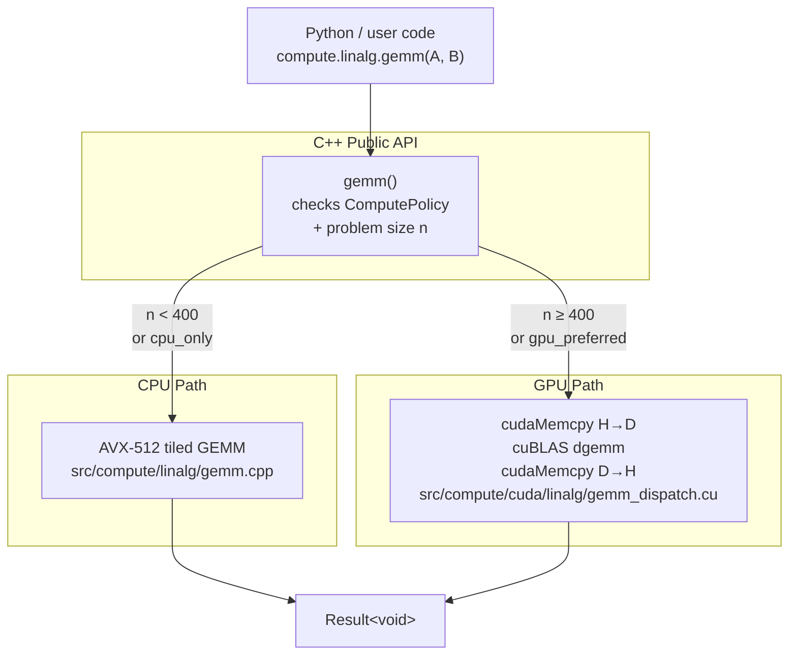
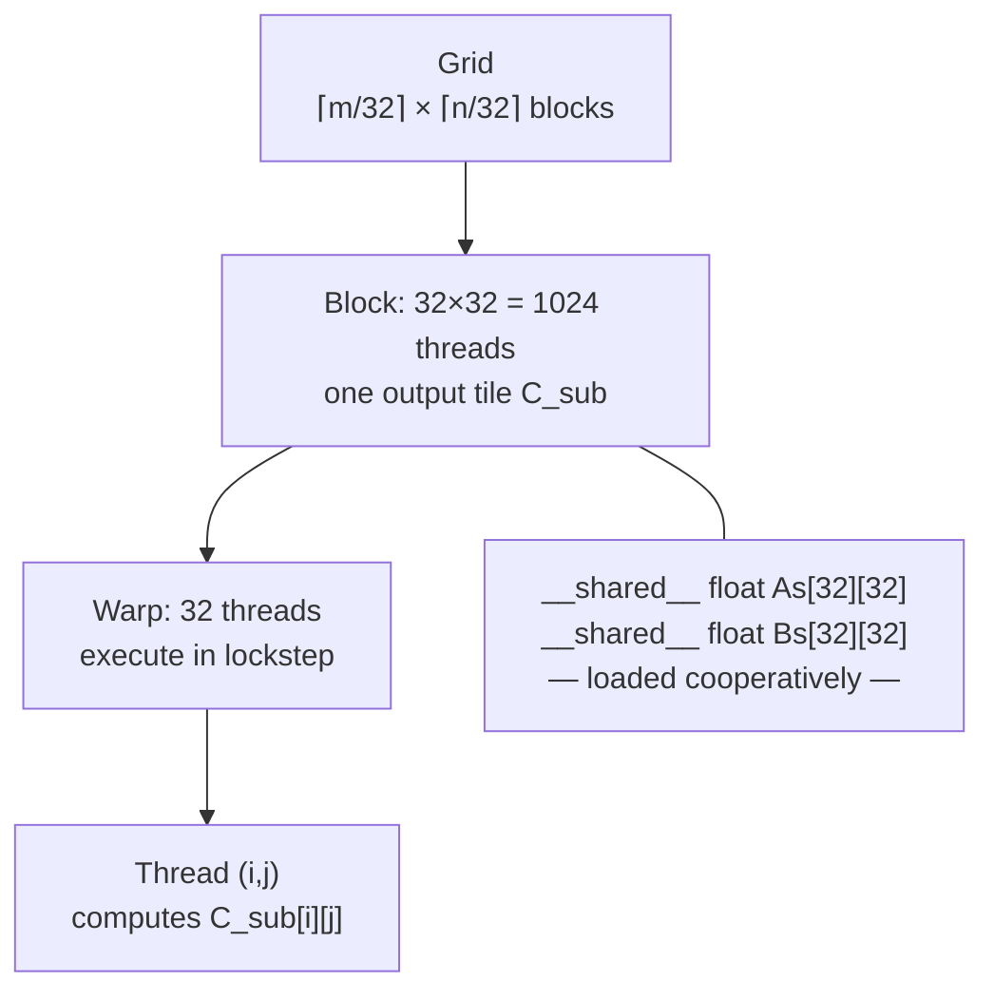

---
tags:
  - linear-algebra
  - tier-5
  - cuda
  - gpu
  - hpc
aliases:
  - linalg tier 5
---

# Tier 5 — GPU Acceleration

> [!warning] Prerequisites
> Install CUDA before starting this tier: `pacman -S cuda eigen`
> Enable in CMake: `cmake --preset release-cuda`

Back to [[Linear Algebra]] | Prev: [[Tier 4 - Eigenvalues & Solvers]]

---

## CPU / GPU Dispatch Architecture5



---

## Checklist

- [ ] Tiled SGEMM CUDA kernel from scratch — $32 \times 32$ shared-memory tiling
- [ ] Bank conflict analysis and fix — padding shared memory arrays
- [ ] cuBLAS DGEMM dispatch layer — CPU/GPU crossover at $n \approx 400$
- [ ] Pinned host memory for transfers — `cudaMallocHost` for PCIe 4.0 throughput
- [ ] Batched matrix inversion — `cublasDgetrfBatched` + `cublasDgetriBatched`
- [ ] Sparse matvec via cuSPARSE — CSR format, `cusparseSpMV`
- [ ] Parallel prefix sum (scan) — warp-level `__ballot_sync` / `__reduce_add_sync`

---

## Key Formulas

**RTX 3060 theoretical peaks**

$$\text{FP32 peak} = 3584 \text{ cores} \times 2 \text{ FLOPs} \times 1.78 \text{ GHz} \approx 12.7 \text{ TFLOPS}$$

$$\text{Memory bandwidth} = 360 \text{ GB/s} \quad \text{(GDDR6)}$$

**Roofline crossover** — operation is compute-bound above this arithmetic intensity $I$

$$I^* = \frac{\text{Peak FLOPS}}{\text{Peak BW}} = \frac{12.7 \times 10^{12}}{360 \times 10^9} \approx 35 \text{ FLOPs/byte}$$

GEMM arithmetic intensity: $I = \frac{2n^3}{3n^2 \cdot 4\text{ bytes}} = \frac{n}{6}$ bytes for FP32 — compute-bound for $n > 210$.

**Tiled SGEMM shared memory layout** — $T \times T$ tile, 4 bytes per float

$$\text{smem per block} = 2 \times T^2 \times 4 \text{ bytes}, \quad T=32 \implies 8 \text{ KB per block}$$

**PCIe 4.0 transfer time** (pinned memory, 25 GB/s)

$$t_{\text{transfer}} = \frac{2 n^2 \times 8 \text{ bytes}}{25 \times 10^9} \quad \text{(two matrices, FP64)}$$

At $n = 400$: $t_{\text{transfer}} \approx 1 \text{ ms}$, comparable to CPU computation — the crossover.

---

## CUDA Thread Hierarchy for GEMM



---

## Implementation Ideas

> [!example] Tiled SGEMM kernel — the one kernel every HPC practitioner writes once
> ```cuda
> __global__ void sgemm_tiled(float* A, float* B, float* C,
>                              int M, int N, int K) {
>     __shared__ float As[TILE][TILE];
>     __shared__ float Bs[TILE][TILE];
>     int row = blockIdx.y * TILE + threadIdx.y;
>     int col = blockIdx.x * TILE + threadIdx.x;
>     float acc = 0.f;
>     for (int t = 0; t < K/TILE; ++t) {
>         As[threadIdx.y][threadIdx.x] = A[row*K + t*TILE + threadIdx.x];
>         Bs[threadIdx.y][threadIdx.x] = B[(t*TILE + threadIdx.y)*N + col];
>         __syncthreads();
>         for (int k = 0; k < TILE; ++k) acc += As[threadIdx.y][k] * Bs[k][threadIdx.x];
>         __syncthreads();
>     }
>     C[row*N + col] = acc;
> }
> ```
> Then benchmark against cuBLAS. Show the gap. That gap **is** the post.

> [!example] Bank conflicts in shared memory
> `__shared__ float As[32][32]`: 32 threads in a warp access `As[threadIdx.y][0..31]` → all map to the same bank → 32-way conflict → 32× slower.
> Fix: pad to `As[32][33]` — shifts each row by one element, eliminates conflicts.
> Post: measure the latency difference with and without padding. NSight shows the bank conflict count directly.

> [!example] Pinned memory for PCIe throughput
> Regular `malloc` → pageable memory → PCIe ~12 GB/s.
> `cudaMallocHost` → pinned memory → PCIe ~25 GB/s (PCIe 4.0 × 16).
> For the dispatch layer: pre-allocate a pinned staging buffer. Amortize the `cudaMallocHost` cost.

> [!example] Batched inversion — a realistic GPU use case
> 10,000 independent $4 \times 4$ matrices (e.g., Kalman filter updates, Gaussian process per patch).
> `cublasDgetrfBatched`: factorize all 10,000 in parallel.
> `cublasDgetriBatched`: invert all 10,000 from LU factors.
> GPU crushes CPU here — 10K independent problems = perfect parallelism.

---

## Post Ideas

> [!tip] LinkedIn angles for this tier

**Algorithm posts**
- "I wrote a CUDA GEMM kernel from scratch and then measured how badly cuBLAS beat me — and why that's the correct lesson"
- "Shared memory bank conflicts: one padding integer that gives $32\times$ speedup"
- "The GPU/CPU crossover curve for GEMM: at what $n$ does the RTX 3060 win?"
- "Batched matrix inversion on GPU: 10,000 $4 \times 4$ matrices in parallel"
- "Parallel prefix sum: the primitive that underlies sparse formats, radix sort, and stream compaction"

**C++ design posts**
- "The dispatch layer: how `ComputePolicy` routes between AVX-512 and cuBLAS transparently"
- "No CUDA types in public headers: designing a GPU-optional C++ API"
- "Pinned vs pageable memory: the PCIe bottleneck you don't notice until you profile"

**Performance posts**
- "Roofline model for SGEMM on RTX 3060: $I^* = 35$ FLOPs/byte — where does my kernel land?"
- "NSight Systems trace: what the gaps between kernels are costing me"
- "cuBLAS vs my kernel: the Nsight performance counter breakdown"

---

## Mathematical Depth

> [!note] Theory worth internalising
> - GPU GEMM operates in the **compute-bound** regime for $n \gtrsim 200$ — arithmetic intensity exceeds the roofline crossover
> - Shared memory acts as a **software-managed L1 cache** — the programmer controls what goes in, unlike hardware caches
> - Bank conflicts occur when $t$ threads access addresses $a_1, \ldots, a_t$ where $a_i \equiv a_j \pmod{32}$ for $i \ne j$ — the 32 banks of 4-byte width each
> - Warp divergence: all 32 threads in a warp execute the same instruction; branching serializes. Boundary-handling in GEMM (non-multiple-of-tile sizes) must be handled carefully.

---

## References

> [!quote] Read before coding this tier
> - **Kirk & Hwu** *Programming Massively Parallel Processors* 4th ed — Ch 3–5 (thread model, shared memory, bank conflicts)
> - **Williams et al.** "Roofline" CACM 2009 (free) — read before the performance post
> - **NVIDIA cuBLAS documentation** — dispatch patterns, batched API
> - **Agner Fog** Optimization Manuals (free) — CPU side of the crossover measurement

→ [[References#HPC SIMD and CUDA]]
