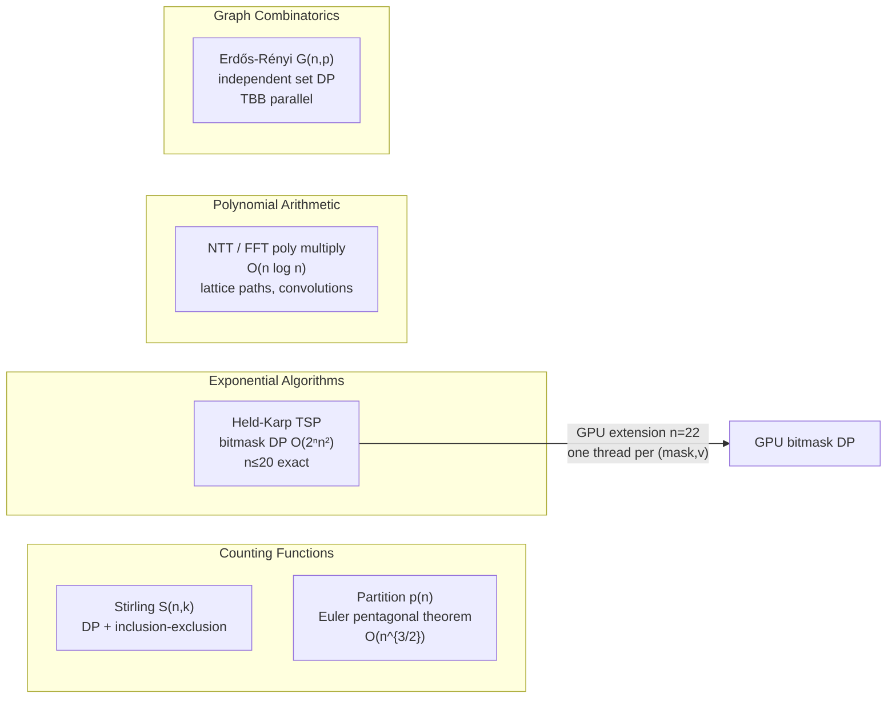
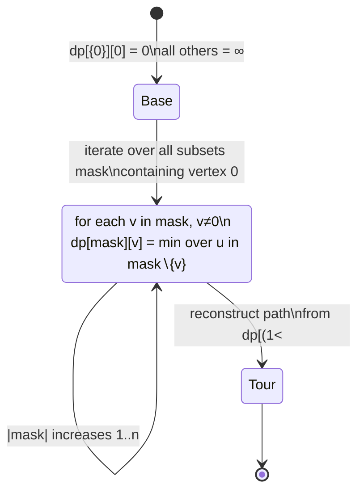

---
tags:
  - combinatorics
  - module
---

# Combinatorics

Back to [[README]]

---

## Module Map

---

## Key Formulas

**Stirling numbers of the second kind** — $S(n,k)$ = ways to partition $n$ elements into $k$ non-empty subsets

$$S(n,k) = k\,S(n-1,k) + S(n-1,k-1), \quad S(n,1) = S(n,n) = 1$$

Closed form via inclusion-exclusion:

$$S(n,k) = \frac{1}{k!}\sum_{j=0}^{k}(-1)^{k-j}\binom{k}{j}j^n$$

**Euler's pentagonal theorem** — partition recurrence

$$p(n) = \sum_{k \ne 0} (-1)^{k+1} p\!\left(n - \frac{k(3k-1)}{2}\right)$$

where the sum is over $k = 1, -1, 2, -2, \ldots$ and $p(0) = 1$, $p(m) = 0$ for $m < 0$.

Hardy-Ramanujan asymptotic:

$$p(n) \sim \frac{1}{4n\sqrt{3}}\exp\!\left(\pi\sqrt{\frac{2n}{3}}\right)$$

**Held-Karp TSP** — exact solution in $O(2^n n^2)$

$$\text{dp}[\text{mask}][v] = \min_{u \in \text{mask},\, u \ne v} \!\bigl(\text{dp}[\text{mask} \setminus \{v\}][u] + w(u,v)\bigr)$$

**Generating function multiplication via FFT** — coefficient of $x^n$ in $f(x)g(x)$

$$[x^n]\,f(x)g(x) = \sum_{k=0}^n f_k\,g_{n-k} \quad \xrightarrow{\text{FFT}} O(n\log n)$$

---

## Held-Karp State Machine

---

## References

> [!quote] Key texts
> - **Graham, Knuth & Patashnik** *Concrete Mathematics* 2nd ed — Ch 5 (Stirling), Ch 7 (generating functions)
> - **Andrews** *The Theory of Partitions* — Ch 1 (pentagonal theorem)
> - **Stanley** *Enumerative Combinatorics* Vol. 1 (free PDF) — Ch 1.1–1.3, 1.8
> - **Held & Karp** "A Dynamic Programming Approach to Sequencing Problems" J. SIAM 1962 (free) — the original paper

→ [[References#Combinatorics]]
