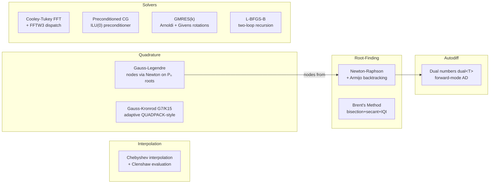

---
tags:
  - numerical-analysis
  - module
---

# Numerical Analysis

Back to [[README]]

---

## Module Map

---

## Key Formulas

**Newton-Raphson with Armijo line search**

$$x_{k+1} = x_k - \alpha_k \frac{f(x_k)}{f'(x_k)}, \quad \alpha_k \text{ chosen so } f(x_k + \alpha_k d_k) \le f(x_k) + c\alpha_k \nabla f \cdot d_k$$

**Convergence orders**

| Method | Order | Condition |
|--------|-------|-----------|
| Bisection | 1 (linear) | always |
| Secant | $\varphi = 1.618...$ (superlinear) | near root |
| Newton | 2 (quadratic) | $f'(x^*) \ne 0$ |
| Brent | superlinear | always (no derivatives needed) |

**Gauss-Legendre nodes** — $n$-point rule exact for polynomials of degree $\le 2n-1$

$$\int_{-1}^{1} f(x)\,dx \approx \sum_{i=1}^n w_i f(x_i)$$

where $x_i$ are roots of the Legendre polynomial $P_n(x)$ — computed via Newton's method.

**Dual number forward AD** — for $f : \mathbb{R} \to \mathbb{R}$

$$f(a + b\varepsilon) = f(a) + f'(a)\,b\varepsilon, \quad \varepsilon^2 = 0$$

**FFT complexity**

$$\text{DFT}: O(n^2) \quad \longrightarrow \quad \text{FFT}: O(n \log n)$$

---

## References

> [!quote] Key texts
> - **Burden & Faires** *Numerical Analysis* 10th ed — Ch 2 (root-finding), Ch 3 (interpolation), Ch 4 (quadrature)
> - **Trefethen** *Approximation Theory and Approximation Practice* (free PDF) — Ch 3–4, 12
> - **Saad** *Iterative Methods for Sparse Linear Systems* (free PDF) — Ch 6
> - **Nocedal & Wright** *Numerical Optimization* 2nd ed — Ch 3 (line search), Ch 7 (L-BFGS)
> - **Baydin et al.** "Automatic Differentiation in ML" JMLR 2018 (free) — §2–3

→ [[References#Numerical Analysis]]
