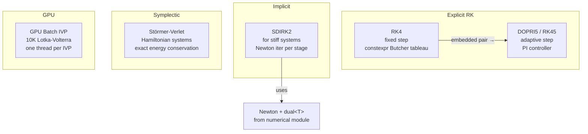
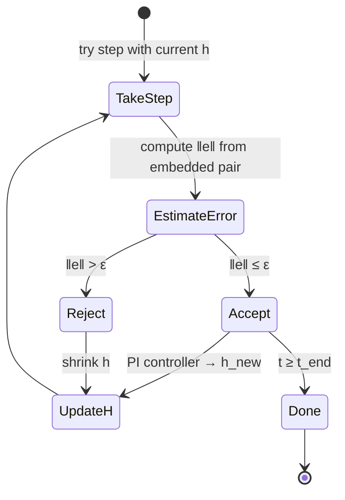

---
tags:
  - ode
  - module
---

# ODE Solvers

Back to [[README]]

---

## Solver Taxonomy

---

## Key Formulas

**General explicit RK** — from Butcher tableau $(A, b, c)$

$$k_i = f\!\left(t_n + c_i h,\; y_n + h \sum_{j=1}^{i-1} a_{ij} k_j\right), \qquad y_{n+1} = y_n + h \sum_{i=1}^s b_i k_i$$

**RK4 tableau** (classic, $s = 4$)

$$y_{n+1} = y_n + \frac{h}{6}(k_1 + 2k_2 + 2k_3 + k_4)$$

$$k_1 = f(t_n, y_n),\quad k_2 = f\!\left(t_n + \tfrac{h}{2}, y_n + \tfrac{h}{2}k_1\right),\quad k_3 = f\!\left(t_n + \tfrac{h}{2}, y_n + \tfrac{h}{2}k_2\right),\quad k_4 = f(t_n+h, y_n+hk_3)$$

**DOPRI5 step-size control** — PI controller (Hairer & Wanner Vol. I, p. 168)

$$h_{\text{new}} = h \cdot \min\!\left(h_{\text{max}},\; \max\!\left(h_{\text{min}},\; \text{fac} \cdot \left(\frac{\varepsilon}{\|e\|}\right)^{0.7/5} \cdot \left(\frac{\|e_{\text{prev}}\|}{\varepsilon}\right)^{0.04/5}\right)\right)$$

**Störmer-Verlet** — symplectic integrator for $\dot{q} = p$, $\dot{p} = f(q)$

$$p_{n+1/2} = p_n + \tfrac{h}{2}f(q_n), \qquad q_{n+1} = q_n + h\,p_{n+1/2}, \qquad p_{n+1} = p_{n+1/2} + \tfrac{h}{2}f(q_{n+1})$$

Energy error is $O(h^2)$ per step but **does not drift** — it oscillates around the true energy.

---

## DOPRI5 Adaptive Step State

---

## References

> [!quote] Key texts
> - **Hairer, Nørsett & Wanner** *Solving ODEs I* 2nd ed — Ch 1–2 (RK methods), Ch 4 (DOPRI5 derivation — the PI controller formula is on p. 168)
> - **Hairer & Wanner** *Solving ODEs II* 2nd ed — Ch 4 (SDIRK methods)
> - **Leimkuhler & Reich** *Simulating Hamiltonian Dynamics* — Ch 1–2 (Verlet, symplecticity)
> - **MIT 18.337J** (free) — Lectures 7–10: modern ODE solver framing

→ [[References#ODE Solvers]]
