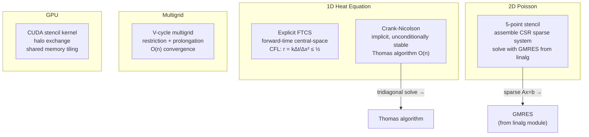

---
tags:
  - pde
  - module
---

# PDE — Partial Differential Equations

Back to [[README]]

---

## Method Taxonomy

---

## Key Formulas

**1D heat equation**

$$\frac{\partial u}{\partial t} = \kappa \frac{\partial^2 u}{\partial x^2}$$

**FTCS discretization** — $r = \kappa \Delta t / \Delta x^2$

$$u_j^{n+1} = u_j^n + r\!\left(u_{j+1}^n - 2u_j^n + u_{j-1}^n\right)$$

**CFL stability condition** for FTCS

$$r = \frac{\kappa\,\Delta t}{\Delta x^2} \le \frac{1}{2}$$

Violating CFL → exponential growth. Von Neumann stability analysis confirms the $\le 1/2$ bound.

**Crank-Nicolson** — average of FTCS and implicit BTCS, unconditionally stable, $O(\Delta t^2, \Delta x^2)$

$$-r u_{j-1}^{n+1} + (2+2r)u_j^{n+1} - r u_{j+1}^{n+1} = r u_{j-1}^n + (2-2r)u_j^n + r u_{j+1}^n$$

Gives a tridiagonal system → Thomas algorithm $O(n)$.

**2D Poisson** — 5-point stencil, $h = \Delta x = \Delta y$

$$-\nabla^2 u = f \quad \Rightarrow \quad \frac{u_{i-1,j} + u_{i+1,j} + u_{i,j-1} + u_{i,j+1} - 4u_{i,j}}{h^2} = -f_{i,j}$$

**Multigrid V-cycle convergence** — geometric convergence per V-cycle

$$\|e^{(k+1)}\| \le \rho\,\|e^{(k)}\|, \quad \rho < 1 \text{ independent of mesh size}$$

Full multigrid: $O(n)$ total work for $n$ unknowns.

---

## References

> [!quote] Key texts
> - **LeVeque** *Finite Difference Methods for ODEs and PDEs* (SIAM) — Ch 1–3, 9 — free supplementary material
> - **Briggs, Henson & McCormick** *A Multigrid Tutorial* 2nd ed (free PDF) — Ch 1–3
> - **Strang** *Computational Science and Engineering* — Ch 6–7, MIT OCW 18.085 (free)

→ [[References#PDE]]
