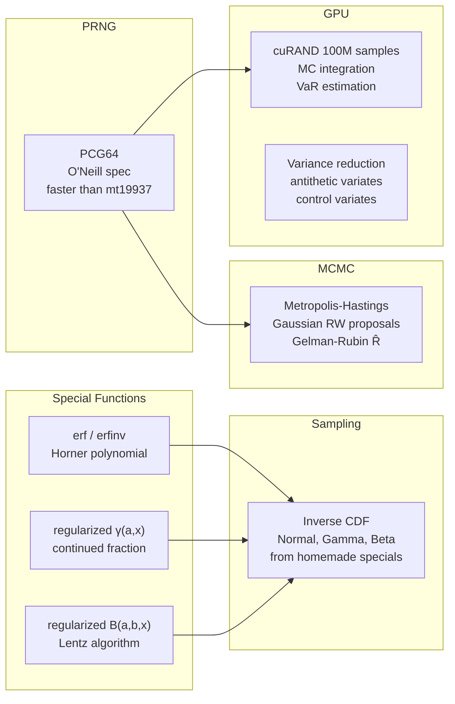

---
tags:
  - probability
  - module
---

# Probability Theory

Back to [[README]]

---

## Module Map

---

## Key Formulas

**erf and erfinv** — Horner polynomial approximation (Abramowitz & Stegun §7.1.26)

$$\operatorname{erf}(x) \approx 1 - (a_1 t + a_2 t^2 + a_3 t^3)e^{-x^2}, \quad t = \frac{1}{1+0.47047\,x}$$

Maximum error: $\le 2.5 \times 10^{-5}$.

**Regularized incomplete gamma** — continued fraction form

$$\Gamma(a, x) = \frac{x^a e^{-x}}{\Gamma(a)} \cdot \cfrac{1}{x+\cfrac{1-a}{1+\cfrac{1}{x+\cdots}}}$$

Converges rapidly for $x > a + 1$ (use series for $x \le a + 1$).

**Normal CDF from erf**

$$\Phi(x) = \frac{1}{2}\!\left[1 + \operatorname{erf}\!\left(\frac{x}{\sqrt{2}}\right)\right]$$

**Metropolis-Hastings acceptance ratio**

$$\alpha(x, x') = \min\!\left(1,\; \frac{\pi(x')\,q(x \mid x')}{\pi(x)\,q(x' \mid x)}\right)$$

For symmetric proposal $q(x \mid x') = q(x' \mid x)$: $\alpha = \min(1, \pi(x')/\pi(x))$.

**Gelman-Rubin $\hat R$ convergence diagnostic** — $m$ chains of length $n$

$$\hat R = \sqrt{\frac{\hat{\text{var}}(\theta)}{W}}, \qquad \hat R \to 1 \text{ indicates convergence}$$

where $W$ = within-chain variance, $\hat{\text{var}}$ = pooled variance estimate.

**Control variate variance reduction**

$$\operatorname{Var}[f - c(g - E[g])] = \operatorname{Var}[f] - 2c\operatorname{Cov}[f,g] + c^2\operatorname{Var}[g]$$

Optimal $c^* = \operatorname{Cov}[f,g]/\operatorname{Var}[g]$, giving reduction factor $1 - \rho_{fg}^2$.

---

## References

> [!quote] Key texts
> - **Abramowitz & Stegun** / **NIST DLMF** (free: dlmf.nist.gov) — §6, §8, §22
> - **Robert & Casella** *Monte Carlo Statistical Methods* 2nd ed — Ch 2 (sampling), Ch 6 (MCMC), Ch 10 (variance reduction)
> - **O'Neill** "PCG: A Family of Fast PRNGs" 2014 (free: pcg-random.org) — read before writing the PRNG
> - **Durrett** *Probability: Theory and Examples* 5th ed (free PDF) — Ch 3 (CLT), Ch 5 (Markov chains)

→ [[References#Probability Theory and Special Functions]]
