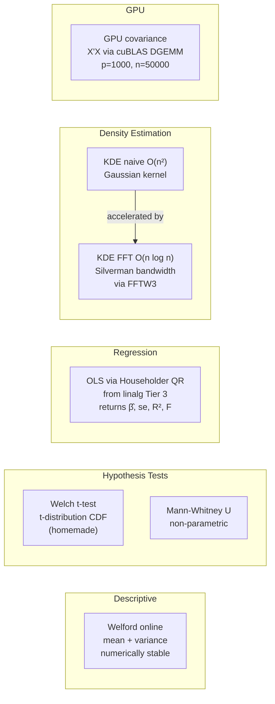

---
tags:
  - statistics
  - module
---

# Statistical Analysis

Back to [[README]]

---

## Module Map

---

## Key Formulas

**Welford's online algorithm** — stable single-pass mean and variance

$$M_1 = x_1, \quad M_k = M_{k-1} + \frac{x_k - M_{k-1}}{k}$$

$$S_k = S_{k-1} + (x_k - M_{k-1})(x_k - M_k), \quad \sigma^2 = \frac{S_n}{n-1}$$

Numerically stable — avoids cancellation in $\sum x_i^2 - n\bar{x}^2$ when values are near a large mean.

**Welch's t-statistic** — two-sample, unequal variances

$$t = \frac{\bar{X}_1 - \bar{X}_2}{\sqrt{s_1^2/n_1 + s_2^2/n_2}}, \qquad \nu = \frac{(s_1^2/n_1 + s_2^2/n_2)^2}{\frac{(s_1^2/n_1)^2}{n_1-1} + \frac{(s_2^2/n_2)^2}{n_2-1}}$$

**OLS via QR** — normal equations $X^\top X\hat\beta = X^\top y$, solved stably via QR

$$\hat\beta = R^{-1}Q^\top y, \quad \text{se}(\hat\beta_j) = \hat\sigma\sqrt{(X^\top X)^{-1}_{jj}}, \quad R^2 = 1 - \frac{\|y - X\hat\beta\|^2}{\|y - \bar y\|^2}$$

**KDE with Silverman's rule** — for $n$ samples, bandwidth

$$h = 1.06\,\hat\sigma\,n^{-1/5}$$

**KDE FFT acceleration** — evaluate $\hat f(x) = \frac{1}{nh}\sum_i K\!\left(\frac{x-x_i}{h}\right)$ via convolution theorem:

$$\hat f = \text{IFFT}\!\left(\text{FFT}(K_h) \cdot \text{FFT}(\text{histogram})\right) \quad O(n \log n) \text{ vs } O(n^2)$$

---

## References

> [!quote] Key texts
> - **Casella & Berger** *Statistical Inference* 2nd ed — Ch 5, 8, 10
> - **Rice** *Mathematical Statistics and Data Analysis* 3rd ed — Ch 11, 14
> - **Silverman** *Density Estimation for Statistics and Data Analysis* — Ch 2–3 (Silverman's rule derivation + FFT acceleration)

→ [[References#Statistical Analysis]]
